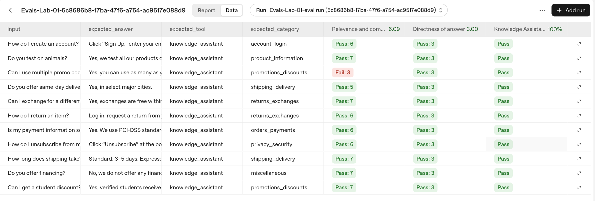

# Builder Bootcamp: Configure, Run, and Evaluate with the Evals API

### Lab Metadata

- **Lab type**: Hands‑on, self‑paced
- **Duration**: ~45 minutes
- **Level**: Advanced builders
- **Environment**: macOS/Linux/Windows terminal, Python 3.10+
- **Repo path**: `labs/lab01_evals_guided`
- **Last updated:** September 14, 2025

### Overview
In this lab, you will use the OpenAI Evals API to grade a small example dataset with a combination of model‑based scoring and deterministic checks. You will:
- **Define testing criteria ("graders")** such as model scorers and string checks.
- **Run an eval** against a JSONL dataset.
- **Inspect results** locally (pass/total) and in the OpenAI Evaluations dashboard.

This lab is intentionally minimal so you can focus on structuring criteria and data, but it's also grounded in a real-world, production-style customer support use case—the kind you'd encounter in an actual helpdesk environment. The example dataset features realistic questions and expected answers, with a few entries designed to fail so you can see how your graders handle non-passing behavior in practice.

### Learning Objectives
After completing this lab, you will gain practical experience configuring, running, and evaluating a full Evals workflow using OpenAI's APIs. Specifically, you will:

1. **Define graders**: Author model‑based and rule‑based criteria in the `testing_criteria.py` file.
2. **Run evals**: Execute `run.py` to create and complete an eval run via the Evals API.
3. **Interpret results**: Read pass/fail totals and understand ranges and thresholds leveraging the API dashboard.

### Prerequisites
- **Python**: 3.10+ recommended
- **Dependencies**: `openai` (modern SDK), `pydantic`
- **API key**: Environment variable `OPENAI_API_KEY`
- **Access**: Org/project must have access to the Evals API
- **ZDR note**: Evals require a non‑ZDR (non–zero data retention) workspace; ZDR orgs cannot create evals.

## Task 1. Set up your environment

> **Note:** If you've already set up your environment and installed the required dependencies as described in the main README or previous labs, you can skip these setup steps.

> **Tip:** For the easiest reading, open this README in **Markdown Preview** mode in your IDE (VSCode, Cursor, etc). It makes the instructions, tables, and code easier to read and scan. Some environments may need a markdown extension.

In this task, you'll get started by cloning the lab repository, setting up your Python virtual environment, and installing all the required libraries and dependencies needed to run the evals.

1. Run the following command to clone and enter the repository (repo root):
```bash
git clone https://github.com/openai-customer-education/builder-bootcamp.git
cd builder-bootcamp
```

<details>
<summary>Windows (PowerShell)</summary>

```powershell
git clone https://github.com/openai-customer-education/builder-bootcamp.git
Set-Location builder-bootcamp
```
</details>

2. Create and activate a virtual environment (Python 3.10+):
```bash
python3 --version
python3 -m venv .venv
source .venv/bin/activate
python -V
```

<details>
<summary>Windows (PowerShell)</summary>

```powershell
python --version
python -m venv .venv
.\.venv\Scripts\Activate.ps1
python -V
```
</details>

3. Now run the following commands to install dependencies:
```bash
python -m pip install --upgrade pip
pip install openai pydantic python-dotenv openai-agents
```

<details>
<summary>Windows (PowerShell)</summary>

```powershell
python -m pip install --upgrade pip
pip install openai pydantic python-dotenv openai-agents
```
</details>

**Checkpoint**: Run the following command to verify imports resolve

```bash
python - << 'PY'
import sys
print('Python OK:', sys.version)
import openai
print('OpenAI OK:', getattr(openai, '__version__', 'unknown'))
from openai import OpenAI
print('Client OK:', bool(OpenAI))
PY
```

<details>
<summary>Windows (PowerShell)</summary>

```powershell
@'
import sys
print('Python OK:', sys.version)
import openai
print('OpenAI OK:', getattr(openai, '__version__', 'unknown'))
from openai import OpenAI
print('Client OK:', bool(OpenAI))
'@ | python
```
</details>

*Expected output:*
```text
Python OK: 3.10.x
OpenAI OK: x.y.z
Client OK: True
```

4. Set your API key for this terminal session:

```bash
export OPENAI_API_KEY=sk-...
```

<details>
<summary>Windows (PowerShell)</summary>

```powershell
$env:OPENAI_API_KEY = "sk-..."
```
</details>

> **Note:** Your instructors should supply you with a specific API key. You can also use your own.

**Checkpoint**: Confirm the key is set (prints a non‑empty value)

```bash
echo $OPENAI_API_KEY
```

<details>
<summary>Windows (PowerShell)</summary>

```powershell
Write-Output $env:OPENAI_API_KEY
```
</details>

*Expected output (example):*
```text
sk-proj-YGLzbhqeIJJ....NoA
```

With your environment ready, let’s explore the lab files and preview the dataset.

## Task 2. Explore the Lab Files and Dataset
Let’s take a moment to learn more about the files in this lab folder and get familiar with the datasets that we’ll be leveraging for this exercise.

### **What’s in This Lab Folder**
- `run.py`: Runner that loads data, creates an eval, starts an eval run, polls for completion, and prints pass/total.
- `testing_criteria.py`: Exercise scaffold you’ll complete in Task 3 (start empty, paste input blocks for relevance/directness, then uncomment steps to assemble `testing_criteria`).
- `testing_criteria_solution.py`: Full reference solution for comparison.
- `evaluation_results_helper.py`: Helper to retrieve result counts (passed, total).
- `labs/data/sample_01.jsonl`: Sample dataset evaluated by default.

Take a moment to explore these files and flag any questions with your facilitators.

### **Preview the data**

Now spend a few minutes familiarizing yourself with the dataset — run the following commands to peek at the first three examples.

```bash
# Peek at the first 3 examples (change 1,3 to see more or different lines)
sed -n '1,3p' labs/data/sample_01.jsonl | jq
```

<details>
<summary>Windows (PowerShell)</summary>

```powershell
Get-Content 'labs/data/sample_01.jsonl' -TotalCount 3 |
  ForEach-Object { $_ | ConvertFrom-Json | ConvertTo-Json -Depth 6 }
```
</details>

**Checkpoint**: You should see JSONL lines similar to the following:

```json
{"item":{"input": "Can I get a student discount?", "expected_answer": "Yes, verified students receive 15% off.", "expected_tool": "knowledge_assistant", "expected_category": "promotions_discounts"}}


{"item":{"input": "How do I return an item?", "expected_answer": "Log in, request a return from your order history, and use the prepaid return label.", "expected_tool": "knowledge_assistant", "expected_category": "returns_exchanges"}}


{"item":{"input": "Do you offer same-day delivery?", "expected_answer": "Yes, in select major cities.", "expected_tool": "knowledge_assistant", "expected_category": "shipping_delivery"}}
```

Each line is a JSON object with a single top‑level key `item`, whose value contains the fields used by the graders:

```json
{"item": {
  "input": "Can I get a student discount?",
  "expected_answer": "Yes, verified students receive 15% off.",
  "expected_tool": "knowledge_assistant",
  "expected_category": "promotions_discounts"
}}
```

Graders reference dataset fields using templating like `{{ item.<field> }}`. The fields available are the following:
- **input:** The question/prompt.
- **expected_answer:** The reference answer text to be graded against.
- **expected_tool:** The expected tool name.
- **expected_category:** The expected category.

> **Note:** Some entries in the dataset are intentionally low-quality or have incorrect `expected_answer` values. This is to ensure that your model scorers will encounter and flag failing cases.

Now that you’re familiar with the dataset, let’s move on to choosing and configuring graders.

## Task 3. Configure Graders

In this task, you will build a robust `score_model` grader and add a deterministic `string_check` as well. 

To configure your graders, you'll start by adding a model-based scorer that uses a detailed rubric (provided as a developer message) and incorporates templated fields for the user message. You'll need to specify the scoring `range` and the `pass_threshold` that determines what counts as a passing score. 

In addition to the model-based scorer, you will also include a deterministic check—such as a `string_check`—to verify that certain fields (like the tool used) match expected values. This combination allows you to evaluate both the quality of the answer and whether the correct tool or category was selected.

For this lab, the relevance scorer uses a 1-7 range with `pass_threshold: 6`. A score of 5 means the answer is useful but still has small gaps; requiring 6 keeps the dashboard from showing a perfect pass rate when some answers are only borderline acceptable.

1. Open `run.py` and ensure the testing criteria import (around line 23) points to the exercise module:

```python
from labs.lab01_evals_guided.testing_criteria import testing_criteria
```

2. Now open the `testing_criteria.py` file. 

You’ll see prebuilt scaffolds for `RELEVANCE_SCORER`, `DIRECTNESS_SCORER`, and `STRING_CHECK_TOOL`). You’ll assemble these into the exported `testing_criteria` list.

**Checkpoint (starter state):** The exercise file should export an empty list named `testing_criteria`. Run the following command to verify:

```bash
python - << 'PY'
from labs.lab01_evals_guided.testing_criteria import testing_criteria
print('Criteria count:', len(testing_criteria))
PY
```

<details>
<summary>Windows (PowerShell)</summary>

```powershell
@'
from labs.lab01_evals_guided.testing_criteria import testing_criteria
print('Criteria count:', len(testing_criteria))
'@ | python
```
</details>

*Expected output:*
```text
Criteria count: 0
```

3. Now add your first grader (relevance and completeness). Paste the block below into `RELEVANCE_SCORER["input"]` in `testing_criteria.py`:
```python
    {
        "role": "developer",
        "content": (
            "You are grading how well the EXPECTED_ANSWER aligns with and addresses the USER_QUESTION. "
            "Scoring rubric (1 to 7): "
            "1 - Not aligned or incorrect. "
            "2 - Poor alignment; largely incomplete or off-topic. "
            "3 - Partial alignment; addresses main point with notable gaps. "
            "4 - Mostly aligned; minor gaps. "
            "5 - Well aligned; correct and useful with small gaps. "
            "6 - Very well aligned; nearly perfect. "
            "7 - Perfect alignment; fully correct and directly useful. "
            "Consider factuality, directness, coverage of constraints, safety, and actionable detail. "
            "Return ONLY a numeric score in [1,7]. No text."
        ),
    },
    {
        "role": "user",
        "content": (
            "USER_QUESTION: {{ item.input }}\n"
            "EXPECTED_ANSWER: {{ item.expected_answer }}"
        ),
    },
```

4. Then, at the bottom of that file, uncomment the following line so the exported list contains exactly one entry:
```python
testing_criteria = [RELEVANCE_SCORER]
```

**Checkpoint:** run the following command to verify that a single criterion loads:
```bash
python - << 'PY'
from labs.lab01_evals_guided.testing_criteria import testing_criteria
print('Criteria count:', len(testing_criteria))
print('Names:', [c.get('name') for c in testing_criteria])
PY
```

<details>
<summary>Windows (PowerShell)</summary>

```powershell
@'
from labs.lab01_evals_guided.testing_criteria import testing_criteria
print('Criteria count:', len(testing_criteria))
print('Names:', [c.get('name') for c in testing_criteria])
'@ | python
```
</details>

*Expected output:*

```bash
Criteria count: 1
Names: ['Relevance and completeness of answer']
```

5. Now append a second scorer (directness of answer). Paste the block below into `DIRECTNESS_SCORER["input"]` in `testing_criteria.py`:
```python
    {
        "role": "developer",
        "content": (
            "You are grading whether the ANSWER responds directly and only to the CUSTOMER_QUESTION, without offering to follow up, email, or provide updates later. "
            "Scoring rubric (1 to 3): "
            "3 - Perfect: The answer is direct, complete, and only addresses the question. "
            "2 - Some deviation: The answer mostly addresses the question but includes minor extra behavior or is slightly incomplete. "
            "1 - High deviation: The answer is off-topic, incomplete, or includes significant extra behavior (e.g., offers to follow up, email, or update later). "
            "Return ONLY a numeric score in [1,3]. No text."
        ),
    },
    {
        "role": "user",
        "content": (
            "CUSTOMER_QUESTION: {{item.input}} ANSWER: {{item.expected_answer}}"
        ),
    },
```

Then, at the bottom of that file, uncomment Step 2 so the list contains two entries:
```python
testing_criteria = [RELEVANCE_SCORER, DIRECTNESS_SCORER]
```

**Checkpoint:** run the following command to verify that two criteria load:
```bash
python - << 'PY'
from labs.lab01_evals_guided.testing_criteria import testing_criteria
print('Criteria count:', len(testing_criteria))
print('Names:', [c.get('name') for c in testing_criteria])
PY
```

<details>
<summary>Windows (PowerShell)</summary>

```powershell
@'
from labs.lab01_evals_guided.testing_criteria import testing_criteria
print('Criteria count:', len(testing_criteria))
print('Names:', [c.get('name') for c in testing_criteria])
'@ | python
```
</details>


*Expected output:*
```text
Criteria count: 2
Names: ['Relevance and completeness of answer', 'Directness of answer']
```

6. Now, create a deterministic check (string_check). The input block represents the text that needs checking, the operation is the comparison made and the reference is the expected answer. We want to check if the `expected_tool` is equal to "knowledge_assistant", so the code should look like this: 
```python
STRING_CHECK_TOOL: dict = {
    "type": "string_check",
    "name": "Knowledge Assistant tool called",
    "input": "{{ item.expected_tool }}",
    "operation": "eq",
    "reference": "knowledge_assistant",
}
```

At the bottom of `testing_criteria.py`, uncomment Step 3 so the exported list includes all three entries:

```python
testing_criteria = [
    RELEVANCE_SCORER,
    DIRECTNESS_SCORER,
    STRING_CHECK_TOOL,
]
```

Your testing criteria is now set with this final shape:
```python
testing_criteria = [
    { ... Relevance and completeness (score_model) ... },
    { ... Directness of answer (score_model) ... },
    { ... Knowledge Assistant tool called (string_check) ... },
]
```

**Checkpoint:** Double‑check the full set is available.

```bash
python - << 'PY'
from labs.lab01_evals_guided.testing_criteria import testing_criteria
print('Criteria count:', len(testing_criteria))
print('Types:', [c.get('type') for c in testing_criteria])
print('Names:', [c.get('name') for c in testing_criteria])
PY
```

<details>
<summary>Windows (PowerShell)</summary>

```powershell
@'
from labs.lab01_evals_guided.testing_criteria import testing_criteria
print('Criteria count:', len(testing_criteria))
print('Types:', [c.get('type') for c in testing_criteria])
print('Names:', [c.get('name') for c in testing_criteria])
'@ | python
```
</details>

*Expected output:*
```text
Criteria count: 3
Types: ['score_model', 'score_model', 'string_check']
Names: ['Relevance and completeness of answer', 'Directness of answer', 'Knowledge Assistant tool called']
```

Now that we've configured testing criteria, we're ready to run our eval end‑to‑end from our shell.

## Task 4. Run the eval

With your graders assembled, let’s execute the runner. This task will also validate your configuration end‑to‑end.

In this process, you’ll create the eval, start a run over your dataset, and watch the status stream in real time—so you can confirm local pass/fail results before heading to the dashboard to review your findings.

### What the runner does
At a high level, the runner:
1. Loads the dataset from `labs/data/sample_01.jsonl`.
2. Defines an item schema (`EvalItem`) and creates an eval with a custom data source configuration.
3. Starts an eval run with the items provided inline as JSONL content.
4. Polls until the run reaches a terminal state.
5. Retrieves `passed` and `total` and prints a summary like `Eval run score: 7 / 11 passed`.

### Executing the runner

1. Execute the runner by running the following script:
```bash
python -m labs.lab01_evals_guided.run
```

2. Observe progress
The script prints the number of loaded samples, creates the eval, starts a run, and polls until a terminal state.

**Checkpoint:** You should see output like the following:

```text
Run UUID: 123e4567-e89b-12d3-a456-426614174000
Loaded 11 samples from file.
Sample 1: Q: Can I get a student discount? | Expected A: Yes, verified students receive 15% off.
...
Created eval definition:
Started eval run: evalrun_68c5c86fd068819199a6203d73041e35 (status=queued)
Eval run status: queued
Eval run status: queued
Eval run status: in_progress
Eval run status: in_progress
Eval run status: in_progress
Eval run status: in_progress
Eval run status: in_progress
Eval run status: in_progress
Eval run status: in_progress
Eval run status: in_progress
Eval run status: in_progress
Eval run status: in_progress
Eval run status: in_progress
Eval run status: completed
Eval run finished with status: completed
Eval run score: 7 / 11 passed
Navigate to https://platform.openai.com/evaluation/evals/eval_68c5c86fd068819199a6203d73041e35 to see the evaluation run
```

> **Note:** Your final eval score may differ slightly from the example above, depending on model updates or changes to your graders and thresholds. With the default relevance threshold set to 6, you should see at least one non-passing item rather than a 100% pass dashboard.

Now that you've completed a successful run, you will review your findings in the dashboard to examine rubric outcomes.

## Task 5. View and interpret results in the dashboard

Now that you've seen how to run an eval and interpret the console output, let's explore how to review your results visually and in more detail using the OpenAI Platform dashboard.

1. Navigate to OpenAI Platform, and open the [Evaluations dashboard](https://platform.openai.com/evaluations).

2. Now locate your eval and most recent run. Use the eval id printed by the script (e.g., `eval_68c5..`) and open the latest run (it should match the ID in your console output).

3. Use the screenshot below as a layout reference. With the default `pass_threshold: 6`, your updated run should show at least one non-passing item instead of a perfect pass rate:



4. Review the following:
- Item‑level scores and any failing criteria.
- Criterion to see rubric details and raw model output.
- Observed scores to each criterion’s `range` and `pass_threshold`.

**Checkpoint**: Evals appears in the dashboard with item‑level scores and pass/fail totals.


## Optional Tasks

Great job making it this far! 

If you have time, you can explore further by trying one (or both) of the following:

- **Tighten or relax your graders:**  
  Adjust the scoring rubrics or pass thresholds in your `testing_criteria` file (for example, lower the relevance `pass_threshold` from 6 to 5, or raise it to 7). Then, re-run the eval and observe how your overall pass rate changes. This helps you understand the impact of stricter or more lenient evaluation criteria.

- **Customize the dataset:**  
  Try evaluating your own data by creating a new JSONL file with your own examples (see the next section, "Customizing the Dataset," for instructions). Update the `sample_file` path in `labs/lab01_evals_guided/run.py` to point to your new file, and see how your evaluation suite performs on your custom scenarios.

- If you are hungry for more practice, consider how you would approach some of the open questions in `EXTENTIONS_README.md` You can ask the facilitators for advice if you get stuck.

Feel free to experiment with both options to see how your eval results shift. This hands-on exploration will help you get comfortable tuning and extending your evaluation suite.


### Customizing the Dataset

If you'd like to evaluate your own data, follow these steps:

1. Create a new JSONL file. Each line should have a top-level `item` key containing the fields your criteria expect.
2. Use the same field names as the sample dataset, or update your criteria templates to match your custom fields.
3. Update the `sample_file` path in `labs/lab01_evals_guided/run.py`, or modify the runner logic to point to your new file.

## Conclusion

### Wrap‑Up
In this lab, you completed a full eval workflow from start to finish:
1. Set up your Python environment and installed all required dependencies
2. Explored the sample dataset and understood its structure and fields
3. Authored and customized graders in `testing_criteria.py`, including both model-based and rule-based (deterministic) checks
4. Ran an eval using `run.py` against your dataset, observing how the graders applied to each sample
5. Interpreted the results, adjusted thresholds and criteria, and re-ran the eval to see how changes affected pass/fail outcomes

**Checkpoint**: To complete the lab, show your eval run output or the dashboard view to a facilitator for credit.

### Discussion Prompts

Consider the following questions to reflect on your eval design and deployment strategy:
- **Operational acceptance**: What combination of criteria and thresholds represents “ship‑ready” quality for your support automation?
- **Precision vs. coverage**: Where should you be strict (e.g., safety/compliance), and where can you be lenient (e.g., style)?
- **Signals and tooling**: Besides answer quality, what other enterprise signals (tool usage, category routing) should be validated before rollout?

### Troubleshooting

If you encounter issues during the lab, refer to these common problems and their solutions:

- **No samples loaded. Exiting.**
  - Cause: The dataset path is wrong or file is empty.
  - Fix: Ensure `labs/data/sample_01.jsonl` exists and lines are shaped as `{ "item": { ... } }`.

- **Authentication / 401 or 403**
  - Cause: Missing/invalid `OPENAI_API_KEY` or org/project lacks Evals access.
  - Fix: Re‑export the key; verify you’re in a non‑ZDR workspace with Evals enabled.

- **ZDR workspace not supported**
  - Cause: You’re in a zero‑data‑retention org/project.
  - Fix: Switch to a non‑ZDR workspace for Evals runs.

- **Timeout waiting for eval run**
  - Cause: Large queue or long‑running eval.
  - Fix: Re‑run later or increase `timeout_seconds` in `_wait_for_run_completion`.

- **ModuleNotFoundError: openai / pydantic**
  - Cause: Dependencies not installed in your venv.
  - Fix: Activate venv and run `pip install openai pydantic python-dotenv`.
