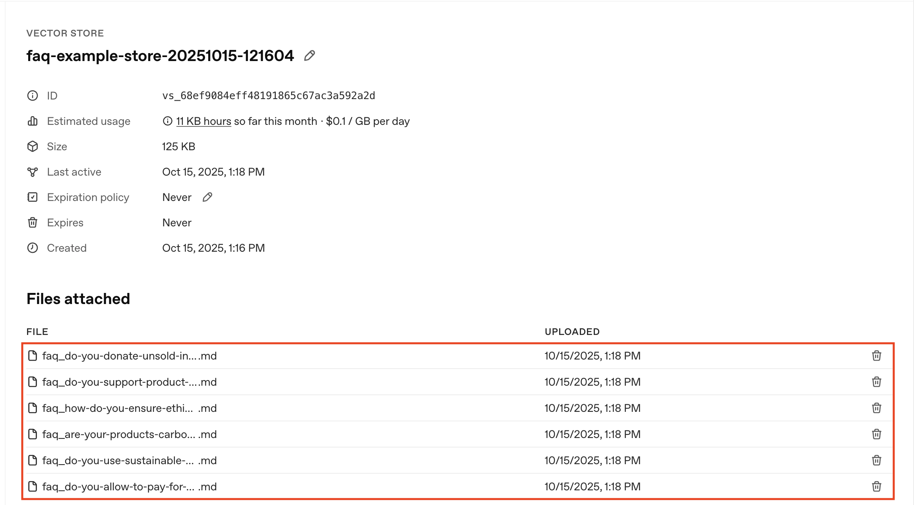
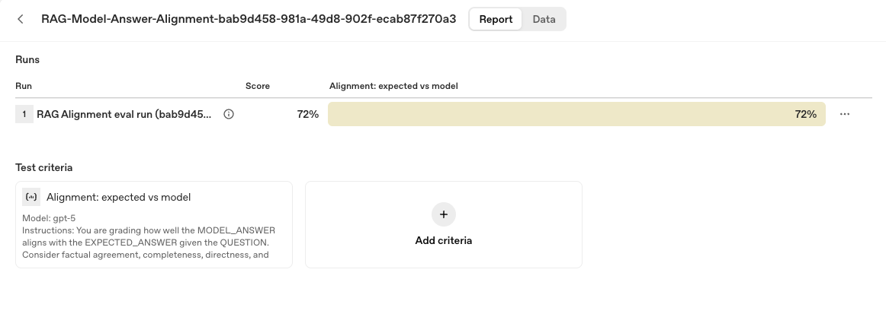

# Builder Bootcamp: RAG Challenge Lab

### Lab metadata
- **Lab type**: Hands-on challenge
- **Duration**: ~45–60 minutes
- **Level**: Advanced builders
- **Environment**: macOS/Linux/Windows terminal, Python 3.10+
- **Repo path**: `labs/lab03_rag_challenge`
- **Last updated**: September 24, 2025

## Overview

This is the challenge version of the Retrieval‑Augmented Generation (RAG) lab. You’ll implement a full end‑to‑end RAG pipeline with minimal scaffolding. In this challenge, you are responsible for building a complete RAG pipeline from scratch—no step‑by‑step instructions, no pre‑built helpers. 

Unlike the guided version, this lab is intentionally open‑ended: you must define the data schema, handle file I/O, manage vector store creation, and author your own graders and evaluation logic. You are responsible for making key design decisions and ensuring your pipeline works end‑to‑end.

## Tasks at a glance

In this challenge lab, you will complete the following tasks:

1. Parse a provided FAQ markdown file and convert each Q&A into a structured JSONL format for downstream use.
2. Create a vector store using your processed FAQ data, ensuring it is properly indexed for semantic retrieval.
3. Implement retrieval logic to fetch relevant FAQ entries in response to user questions, and use the retrieved context to generate model answers via the OpenAI Responses API.
4. Design and run your own evaluation criteria—at least one grader must be model‑based—to assess the quality and accuracy of your generated answers.

### How to work through the code

- Each step file includes clearly marked TODOs using the pattern “Task N.M”.
- Open the file for the current task and implement each Task block in order.
- After you complete a Task block, run the matching command in this README to validate your work.
- Use the Checkpoints/Expected output to verify you’re on track before moving on.

## Objectives

By the end of this lab, you’ll prove you can:
1. Build a RAG pipeline from scratch using OpenAI’s File Search and Responses APIs.
2. Make and justify design choices about prompts, retrieval depth, and reasoning effort.
3. Create and apply evaluation criteria tailored to your use case.

## Scenario: Acme Commerce Group 

You are a Senior Data Engineer at Acme Commerce Group, a global e‑commerce and digital services company.

**Your mission**
- Build a next‑generation RAG pipeline to power Acme’s new AI‑driven support assistant using real, production‑grade FAQ documentation (account, payments, shipping, privacy, loyalty, partnerships, etc.).

**The challenge**
- Deliver a prototype in **< 2 hours** for an investor demo and compliance review.
- Parse and structure 100+ FAQ Q&A, create a high‑quality vector store, and deliver grounded answers using File Search and Responses.
- Design and implement your own evaluation criteria (at least one model‑based grader).

**Why this matters**
- Customer trust, compliance, and operational excellence are on the line; incorrect answers risk revenue, legal issues, and churn.
- Success means deployment across global support channels and a step‑change in customer experience.

## Requirements (quick)

> **Note:** If you've already set up your environment and installed the required dependencies as described in the main README or previous labs, you can skip these setup steps.
> **Tip:** For the easiest reading, open this README in **Markdown Preview** mode in your IDE (VSCode, Cursor, etc). It makes the instructions, tables, and code easier to read and scan. Some environments may need a markdown extension.

- Python 3.10+
- Environment variable: `OPENAI_API_KEY`
- Python packages: `openai`, `pydantic`, `python-dotenv`, `openai-agents`
- Optional CLI: `jq` (for JSON previews in checkpoints)

Quick setup (if needed):
```bash
python3 -m venv .venv && source .venv/bin/activate
python -m pip install --upgrade pip
pip install openai pydantic python-dotenv openai-agents
export OPENAI_API_KEY=sk-...
```

<details>
<summary>Windows (PowerShell)</summary>

```powershell
python -m venv .venv
.\.venv\Scripts\Activate.ps1
python -m pip install --upgrade pip
pip install openai pydantic python-dotenv openai-agents
$env:OPENAI_API_KEY = "sk-..."
```
</details>

Verify:
```bash
python - << 'PY'
from openai import OpenAI
print('Client OK:', bool(OpenAI))
PY
```

Next, get oriented with the lab directory and datasets.

## Explore the lab files

Take a moment to learn more about the files in this lab directory and get familiar with the datasets that we’ll be leveraging for this exercise.

### What’s in this lab directory

Here’s a quick overview of the main scripts and files you’ll use throughout this lab:

- `step_01_process_faq.py`: Extracts Q/A pairs from `faq_example.md` and writes `labs/data/faq_example.jsonl`
- `step_02_create_vector_store.py`: Creates/uses a vector store and saves `VECTOR_STORE_ID` to `.env`
- `step_03_run_questions.py`: Loads `sample_01.jsonl`, queries the vector store, and writes answers to `labs/data/rag_model_answer.jsonl`
- `step_04_eval_results.py`: Grades model answers using `testing_criteria.py`
- `testing_criteria.py`: Defines the grading rubric (model scorer)

Take a moment to explore these files and flag any questions with your facilitators.

### Preview the data
Before you begin the hands‑on steps, let's review the key data files used in this lab.

1. `labs/data/faq_example.md`: Source markdown FAQ that you will parse in Task 1.
2. `labs/data/faq_example.jsonl`: Structured dataset written by Task 1.
3. `labs/data/sample_01.jsonl`: Sample customer questions used by Task 3.
4. `labs/data/rag_model_answer.jsonl`: Augmented output with questions and model answers produced in Task 3.

Take a moment to review these files so you know where each step reads and writes. Once you're ready, move onto your first challenge step.

## Task 1: Extract a markdown FAQ into JSONL

**Goal:** Your first task for Acme is to turn the raw FAQ markdown (`data/faq_example.md`) into a machine‑usable dataset that preserves intent, expected answers, and routing signals. This gives you a clean foundation for indexing and later evals, and lets you control the field names you’ll template against downstream. Each object must include `input`, `expected_answer`, `expected_tool`, and `expected_category`.

**Where to work:** `labs/lab03_rag_challenge/step_01_process_faq.py`

**How to test and run:**

```bash
python -m labs.lab03_rag_challenge.step_01_process_faq
```

**Checkpoint 1:** Confirm the JSONL file exists and inspect the first record.

```bash
test -f labs/data/faq_example.jsonl && jq . labs/data/faq_example.jsonl | head -n 7
```

<details>
<summary>Windows (PowerShell)</summary>

```powershell
if (Test-Path 'labs/data/faq_example.jsonl') {
    Get-Content 'labs/data/faq_example.jsonl' |
      Select-Object -First 1 |
      ForEach-Object { $_ | ConvertFrom-Json | ConvertTo-Json -Depth 6 }
}
```
</details>

**Expected output:**

```json
{
  "item": {
    "input": "How do I create an account?",
    "expected_answer": "Click “Sign Up,” enter your email, set a password, and verify via email. It takes less than two minutes.",
    "expected_tool": "knowledge_assistant",
    "expected_category": "account_and_login"
  }
}
```

**Checkpoint 2:** Check extracted FAQ categories and their counts.

```bash
jq -r '.item.expected_category' labs/data/faq_example.jsonl | sort | uniq -c | sort -nr
```

<details>
<summary>Windows (PowerShell)</summary>

```powershell
Get-Content 'labs/data/faq_example.jsonl' |
  ForEach-Object { ($_ | ConvertFrom-Json).item.expected_category } |
  Group-Object |
  Sort-Object Count -Descending |
  Format-Table Count, Name -AutoSize
```
</details>

**Expected output (truncated):**

```text
10 customer_support
 7 orders_and_payments
 7 account_and_login
 6 shipping_and_delivery
 6 miscellaneous
 5 technical_support
 5 subscriptions_and_memberships
```

This confirms your structured dataset reflects current topics and is ready to be indexed into a vector store. When your JSONL looks clean, continue to Task 2 to create and populate your vector store.

## Task 2: Create & populate a vector store

**Goal:** Index Acme’s FAQ into a reusable vector store so answers can be grounded in retrieved evidence.  When you run this script in final form, it reads your structured FAQ JSONL file and processes each entry by rendering it into a compact markdown document. Each markdown file is then uploaded to File Search, with the script ensuring that any previous version of the file (based on a deterministic filename) is replaced—keeping your vector store current and free of duplicates. 

> **Note:** File Search automatically chunks content during ingestion. Since each uploaded `.md` is a short, self-contained FAQ, the default settings are sufficient—no chunk tuning is required.


**Where to work:** `labs/lab03_rag_challenge/step_02_create_vector_store.py`

**How to test and run:**

```bash
python -m labs.lab03_rag_challenge.step_02_create_vector_store
```

> **Note:** If this command hangs, hit `Ctrl+C` to stop it, then run the following commands (or variants) to remove any stale vector store IDs - the above command should kick off with `Created vector store: vs-...` after running it for the first time:
>
> ```bash
> unset VECTOR_STORE_ID
> for f in "labs/lab03_rag_challenge/.env"; do
>   [ -f "$f" ] && sed -i '' '/^VECTOR_STORE_ID=/d' "$f"
> done
> echo "Shell VAR: ${VECTOR_STORE_ID:-not set}"
> grep -n '^VECTOR_STORE_ID=' labs/lab03_rag_challenge/.env || echo "not set in challenge .env"
> ```

<details>
<summary>Windows (PowerShell) equivalent of the above</summary>

```powershell
Remove-Item Env:VECTOR_STORE_ID -ErrorAction SilentlyContinue
if (Test-Path 'labs/lab03_rag_challenge/.env') {
    Select-String -Path 'labs/lab03_rag_challenge/.env' -Pattern 'VECTOR_STORE_ID'
} else {
    Write-Output 'not set'
}
```
</details>


**Checkpoint 1:** Confirm you receive a similar output to the following after you execute your script.

**Expected output:**

```bash
Created vector store: vs_68d1cc3a4d548191b0d44327637b216a (faq-example-store-20250922-222249)
Updated <repo-root>/labs/lab03_rag_challenge/.env with VECTOR_STORE_ID=vs_68d1cc3a4d548191b0d44327637b216a
Upserted 'faq_how-do-i-create-an-account_835a5474e2.md' (file_id=file-CXKsxJ76Zsumk4dtpu9LMf)
Upserted 'faq_i-forgot-my-password-how-can-i-reset-it_c1eb73cc87.md' (file_id=file-BLeM1Djr2XQ68aW9trJ7E6)
Upserted 'faq_can-i-change-my-email-address_d25de7daaf.md' (file_id=file-FjMtxyEdiyTT4PEk2feScY)
..............
Indexing complete. 101 items upserted. Vector store id: vs_68d1cc3a4d548191b0d44327637b216a
```

**Checkpoint 2:** Run the following command to verify that your `VECTOR_STORE_ID` has been saved:

```bash
grep VECTOR_STORE_ID labs/lab03_rag_challenge/.env
```

<details>
<summary>Windows (PowerShell)</summary>

```powershell
Select-String -Path 'labs/lab03_rag_challenge/.env' -Pattern 'VECTOR_STORE_ID'
```
</details>

**Expected output:**
```text
VECTOR_STORE_ID=vs_...
```

**Checkpoint 3:** Inspect your vector store in the Platform console to verify the uploads.

**Expected output:**



You've successfully converted each of Acme' FAQ entries into markdown documents, uploaded the files to File Search, and saved the resulting `VECTOR_STORE_ID` to `labs/lab03_rag_challenge/.env`. Now that Acme’s FAQs are indexed, you'll wire the store into a retrieval‑augmented answering loop.


## Task 3: Retrieve & answer questions (File Search + Responses)

**Goal:** Build a script that attaches to Acme’s vector store, retrieves context for each question, generates grounded answers, and writes them to a new JSONL for evaluation.

**Where to work:** `labs/lab03_rag_challenge/step_03_run_questions.py`

**How to test and run:**

```bash
python -m labs.lab03_rag_challenge.step_03_run_questions
```
 
**Checkpoint 1:** Confirm the run metadata prints and that the correct `VECTOR_STORE_ID` is loaded from `labs/lab03_rag_challenge/.env`. 

**Expected output:**

```bash
Run UUID: febfdae8-f890-467e-8266-609cc571fb04
Model: gpt-5-nano
Vector Store ID: vs_68d2efa2916c8191b0c50cb8a41fa361
Max file results: 5

================================================================================
Q1: Can I get a student discount?
--------------------------------------------------------------------------------
A1: - Yes. There is a student discount for verified students. Verified students receive 15% off. 
- The discount requires valid student verification. 

Would you like me to help you start the verification process or provide more details on eligibility?

........

Wrote 11 augmented item(s) with model answers to: /Users/.../builder-bootcamp/labs/data/rag_model_answer.jsonl
```
**Checkpoint 2:** Run the command below to verify the structure of one of the model answers entries.

```bash
sed -n '1p' labs/data/rag_model_answer.jsonl | jq '.item'
```

<details>
<summary>Windows (PowerShell)</summary>

```powershell
Get-Content 'labs/data/rag_model_answer.jsonl' -TotalCount 1 |
  ForEach-Object { $_ | ConvertFrom-Json | Select-Object -ExpandProperty item } |
  ConvertTo-Json -Depth 6
```
</details>

**Expected output:**
```json
{
  "input": "Can I get a student discount?",
  "expected_answer": "Yes, verified students receive 15% off.",
  "expected_tool": "knowledge_assistant",
  "expected_category": "promotions_discounts",
  "model_answer": "- Yes. There is a student discount for verified students. Verified students receive 15% off. \n- The discount requires valid student verification. \n\nWould you like me to help you start the verification process or provide more details on eligibility?"
}
```

Here it all comes together: each item now includes the question (`input`), the reference answer (`expected_answer`), routing signals (`expected_tool`, `expected_category`), and your grounded `model_answer`.

Next, evaluate how well these answers align with Acme’s references.

## Task 4: Evaluate alignment with the Evals API

**Goal:** Quantify how well your grounded answers align with Acme’s reference answers using a rubric of model‑based and deterministic graders. In this step, you will use an evaluation script that loads your model answers, applies the grading criteria defined in `labs/lab03_rag_challenge/testing_criteria.py` (including both model-based and deterministic checks), and summarizes the results with a pass/total score plus a link to detailed feedback in the Evaluations dashboard. This helps you measure and iterate on your RAG pipeline’s answer quality in a systematic, transparent way.

**Where to work:** `labs/lab03_rag_challenge/testing_criteria.py`

> Important: Edit `labs/lab03_rag_challenge/testing_criteria.py`. Scaffolds are provided (alignment, directness, optional string check). Paste your input blocks into each grader’s `input` and then assemble `testing_criteria` per the comments.

**How to test and run:**

```bash
python -m labs.lab03_rag_challenge.step_04_eval_results
```

**Checkpoint 1:** Run the following command to evaluate your model answers against the expected answers:

**Expected output (example):**
```bash
Run UUID: 5b79ec45-57dc-4725-8809-0df16badbf6d
Loaded 11 items from: <repo-root>/labs/data/rag_model_answer.jsonl
Polling every 2s (timeout 600s)
Created eval definition.
Started eval run: evalrun_68d1e75914e48191ba2c25b512000e4b (status=queued)
Eval run status: queued
Eval run status: queued
Eval run status: in_progress
Eval run status: completed
Eval run finished with status: completed
Eval run score: 8 / 11 passed
Navigate to https://platform.openai.com/evaluation/evals/eval_68d1e75914e48191ba2c25b512000e4b to see the evaluation run
View details in the Evaluations dashboard: https://platform.openai.com/evaluations
```

**Checkpoint 2:** Navigate to the [Evaluations dashboard](https://platform.openai.com/evaluations) and ensure your most recent run resembles the following:



Congratulations! With grading complete, you’ve built a complete end-to-end RAG pipeline tailored for Acme’s support FAQ use case—covering extraction of Acme’s FAQ data, indexing, retrieval/answering, and rigorous evaluation.

You now have a measurable, robust solution for Acme that you can further improve by iterating on prompts, retrieval parameters, and grading thresholds to better serve Acme’s customers and support team.

## Optional tuning and exploration

#### Testing criteria
* If you want to explore stricter or looser grading, open `testing_criteria.py` and adjust `range` and `pass_threshold` (or add another check), then rerun Task 4. 

#### Parameters and controls
* If you have a few minutes, feel free to extend the dataset and experiment with the controls that shape retrieval and reasoning. You can try different models and reasoning efforts, and limit coverage to a handful of items. 
* The primary controls are **`MODEL`** (e.g., gpt-5-mini), **`EFFORT`** (low, medium, high), **`NUM_QUESTIONS`** (e.g., 5), and **`MAX_NUM_RESULTS`** (e.g., `8`). 

* For example, you can set them to something like the following and rerun:

    ```bash
    export MODEL="gpt-5-mini"
    export EFFORT="high"
    export NUM_QUESTIONS=5
    export MAX_NUM_RESULTS=8
    export RAG_DATA_FILE="labs/data/sample_01.jsonl"
    export RAG_OUTPUT_FILE="labs/data/rag_model_answer.jsonl"
    python -m labs.lab03_rag_challenge.step_03_run_questions
    ```

    ```powershell
    $env:MODEL = "gpt-5-mini"
    $env:EFFORT = "high"
    $env:NUM_QUESTIONS = "5"
    $env:MAX_NUM_RESULTS = "8"
    $env:RAG_DATA_FILE = "labs/data/sample_01.jsonl"
    $env:RAG_OUTPUT_FILE = "labs/data/rag_model_answer.jsonl"
    python -m labs.lab03_rag_challenge.step_03_run_questions
    ```

With these adjustments you can see how retrieval depth, latency, and model reasoning change grounding quality and answer usefulness.

### Finished already? That was quick!

If you are hungry for more practice, consider how you would approach some of the open questions in `EXTENTIONS_README.md` You can ask the facilitators for advice if you get stuck.

## Conclusion

### Wrap‑Up
In this lab, you built an end-to-end RAG pipeline and workflow from scratch. You were able to:
1. Set up your Python environment and installed all required dependencies.
2. Indexed your FAQ data and created a vector store for retrieval.
3. Developed and ran a retrieval-augmented generation (RAG) pipeline to answer sample questions using your indexed data.
4. Collected and formatted model answers alongside expected answers for evaluation.
5. Evaluated your RAG outputs using the Evals API, reviewed pass/fail results, and iterated on your pipeline or rubric as needed.

**Checkpoint**: To complete the lab, show your eval run output or the dashboard view to a facilitator for credit.

### Discussion Prompts

Consider the following questions to reflect on your RAG pipeline design and deployment strategy:
- **Retrieval tradeoff:** How do you balance retrieval precision versus coverage when curating FAQ sources?
- **Prompt/retrieval tuning:** Which prompt or retrieval adjustments most improved grounding strength in your tests?
- **Production criteria:** What eval thresholds would you require before shipping this workflow to production support teams?

### Troubleshooting

If you encounter issues during the lab, refer to these common problems and their solutions:
- **Missing or invalid OPENAI_API_KEY:** Re-export the key (`echo $OPENAI_API_KEY` on macOS/Linux or `Write-Output $env:OPENAI_API_KEY` in PowerShell should print a non-empty value) and rerun the step.
- **VECTOR_STORE_ID not set:** Re-run Task 2 and confirm `labs/lab03_rag_challenge/.env` includes `VECTOR_STORE_ID=...` before Task 3.
- **No items indexed:** Ensure `labs/data/faq_example.jsonl` exists and contains valid JSONL lines (rerun Task 1 if needed).
- **No questions processed:** Inspect `labs/data/sample_01.jsonl` and confirm each line wraps data under an `item` key: `{"item": {"input": "..."}}`
- **Evals permission or 404:** Verify your workspace has Evals access and is not configured for zero-data-retention (ZDR).
- **Eval polling timeout:** Increase `EVAL_TIMEOUT_SECONDS` or adjust `EVAL_POLL_INTERVAL_SECONDS` and rerun Task 4.
