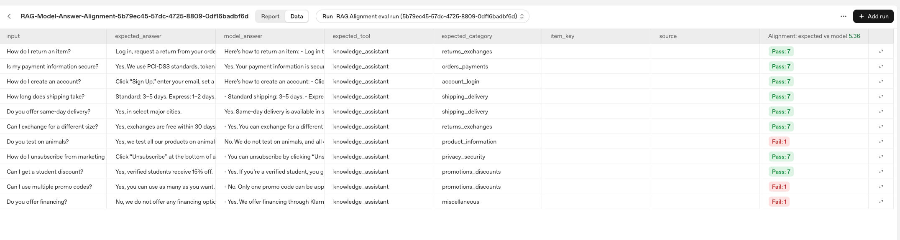

# Builder Bootcamp: Build a RAG pipeline with File Search, Responses and Evals APIs

### Lab metadata

- **Lab type**: Guided, hands-on
- **Duration**: ~60-75 minutes
- **Level**: Advanced builders
- **Environment**: macOS/Linux/Windows terminal, Python 3.10+
- **Repo path**: `labs/lab03_rag_guided`
- **Last updated:** September 23, 2025

### Overview
In this lab, you will use OpenAI’s File Search, Responses, and Evals APIs to build and evaluate a helpdesk-style Retrieval-Augmented Generation (RAG) pipeline. You will:
- **Extract a structured dataset** of Q/A pairs from a markdown FAQ.
- **Create and populate a vector store** with searchable FAQ entries.
- **Ask questions** against the vector store and record model answers.
- **Evaluate alignment** between expected answers and model answers using model-based grading.

This lab is tightly focused to help you quickly master the essentials of structuring data, building retrieval pipelines, and evaluating answer quality in real-world support scenarios, all within the context of a production-style customer support use case—the kind you'd encounter in an actual helpdesk environment.

### Learning objectives
By the end of this lab you will be able to:
1. Structure unstructured FAQs into a consistent, machine‑readable dataset suitable for retrieval and evaluation.
2. Build a reusable vector store and understand how indexing choices impact retrieval quality.
3. Retrieve context and generate grounded answers with configurable model and reasoning settings.
4. Evaluate answer quality with automated graders, interpret pass/total results, and tune thresholds.

### Prerequisites
- **Python**: 3.10+ recommended
- **Dependencies**: `openai`, `pydantic`, `python-dotenv`
- **API key**: Environment variable `OPENAI_API_KEY`
- **Access**: Org/project must have access to File Search, Responses, and the Evals API (non‑ZDR workspace)

## Task 1: Set up your environment

> **Note:** If you've already set up your environment and installed the required dependencies as described in the main README or previous labs, you can skip these setup steps.

> **Tip:** For the easiest reading, open this README in **Markdown Preview** mode in your IDE (VSCode, Cursor, etc). It makes the instructions, tables, and code easier to read and scan. Some environments may need a markdown extension.

Let's get started by cloning the lab repository, setting up your Python virtual environment, and installing all the required libraries and dependencies you'll need for the RAG pipeline and evaluation tasks in this lab.

1. Run the following command to clone and enter the repository (repo root):
```bash
git clone https://github.com/openai-customer-education/builder-bootcamp.git
cd builder-bootcamp
```

<details>
<summary>Windows (PowerShell)</summary>

```powershell
git clone https://github.com/openai-customer-education/builder-bootcamp.git
Set-Location builder-bootcamp
```
</details>

2. Create and activate a virtual environment (Python 3.10+):
```bash
python3 --version
python3 -m venv .venv
source .venv/bin/activate
python -V
```

<details>
<summary>Windows (PowerShell)</summary>

```powershell
python --version
python -m venv .venv
.\.venv\Scripts\Activate.ps1
python -V
```
</details>

3. Now run the following commands to install dependencies:
```bash
python -m pip install --upgrade pip
pip install openai pydantic python-dotenv openai-agents
```

<details>
<summary>Windows (PowerShell)</summary>

```powershell
python -m pip install --upgrade pip
pip install openai pydantic python-dotenv openai-agents
```
</details>

**Checkpoint**: Run the following command to verify imports resolve:

```bash
python - << 'PY'
import sys
print('Python OK:', sys.version)
import openai
print('OpenAI OK:', getattr(openai, '__version__', 'unknown'))
from openai import OpenAI
print('Client OK:', bool(OpenAI))
PY
```

<details>
<summary>Windows (PowerShell)</summary>

```powershell
@'
import sys
print("Python OK:", sys.version)
import openai
print("OpenAI OK:", getattr(openai, "__version__", "unknown"))
from openai import OpenAI
print("Client OK:", bool(OpenAI))
'@ | python
```
</details>

**Expected output:**
```bash
Python OK: 3.10.x
OpenAI OK: x.y.z
Client OK: True
```

4. Set your API key for this terminal session:

```bash
export OPENAI_API_KEY=sk-...
```

<details>
<summary>Windows (PowerShell)</summary>

```powershell
$env:OPENAI_API_KEY = "sk-..."
```
</details>
> **Note:** Your instructors should supply you with a specific API key. You can also use your own.

**Checkpoint**: Confirm the key is set (prints a non‑empty value)

```bash
echo $OPENAI_API_KEY
```

<details>
<summary>Windows (PowerShell)</summary>

```powershell
Write-Output $env:OPENAI_API_KEY
```
</details>

*Expected output (example):*
```text
sk-proj-YGLzbhqeIJJ....NoA
```

With your environment ready, you will now get oriented with the lab's directory structure and key datasets.

## Task 2: Explore the lab files

Let’s take a moment to learn more about the files in this lab directory and get familiar with the datasets that we’ll be leveraging for this exercise.

### What’s in this lab directory

Here’s a quick overview of the main scripts and files you’ll use throughout this lab:

| File | Purpose | Output/Notes |
| --- | --- | --- |
| `step_01_process_faq.py` | Extracts Q/A pairs from `faq_example.md` to a structured dataset. | Writes `labs/data/faq_example.jsonl`. |
| `step_02_create_vector_store.py` | Creates/uses a vector store and uploads each FAQ entry as a small `.md` for File Search. | Saves `VECTOR_STORE_ID` to `labs/lab03_rag_guided/.env`. |
| `step_03_run_questions.py` | Loads questions from `sample_01.jsonl`, queries the vector store via the Responses API, and generates grounded answers. | Writes results (incl. `model_answer`) to `labs/data/rag_model_answer.jsonl`. |
| `step_04_eval_results.py` | Grades model answers against the rubric. | Uses `testing_criteria.py`; prints pass/total for `rag_model_answer.jsonl`. |
| `testing_criteria.py` | Defines the grading rubric (model scorer). | Adjust ranges/thresholds as needed. |

Take a moment to explore these files and flag any questions with your facilitators.

### Preview the data
Before you begin the hands‑on steps, let's review the key data files used in this lab.

1. `labs/data/faq_example.md`: Source markdown FAQ that you will update and parse in tasks 3 and 4.
2. `labs/data/faq_example.jsonl`: Structured dataset written by Task 4.
3. `labs/data/sample_01.jsonl`: Sample customer questions used by Task 6.
4. `labs/data/rag_model_answer.jsonl`: Augmented output with questions and model answers produced in Task 6.

Take a moment to review these files so you know where each step reads and writes.

## Task 3: Update the FAQ data

You will now add a new “Sustainability & Ethics” section to the FAQ to broaden coverage and improve dataset completeness.

1. Open the `faq_example.md` file and append the following at the end of the file (keep the visual separator style and numbering):

```markdown

Sustainability & Ethics
	101.	Do you use sustainable packaging?
Yes, our packaging is made from 95% recycled or biodegradable materials.
	102.	Are your products carbon neutral?
Yes, we offset all carbon emissions from manufacturing and shipping.
	103.	How do you ensure ethical sourcing?
We work with certified suppliers who meet international labor and environmental standards.
	104.	Do you support product recycling?
Yes, we offer a take-back program for electronics and apparel recycling at no extra cost.
	105.	Do you donate unsold inventory?
Yes, unsold items are donated to partner charities rather than discarded.

⸻
```

**Checkpoint:** Check that your new section was added correctly with this command:

```bash
sed -n '/^Sustainability & Ethics$/,/^⸻$/p' labs/data/faq_example.md | sed -n '1,20p'
```

<details>
<summary>Windows (PowerShell)</summary>

```powershell
Get-Content labs/data/faq_example.md |
  Select-String -Pattern '^Sustainability & Ethics$' -Context 0,20
```
</details>

**Expected output (truncated):**
```text
Sustainability & Ethics
	101.	Do you use sustainable packaging?
Yes, our packaging is made from 95% recycled or biodegradable materials.
	102.	Are your products carbon neutral?
Yes, we offset all carbon emissions from manufacturing and shipping.
...
```

With the dataset updated, you’re ready to continue to the next step.

## Task 4: Extract FAQ to JSONL

Let's extract all Q/A pairs from the FAQ and write them to JSONL (one JSON object per line) for easy streaming and diffing. 

Each object includes `input`, `expected_answer`, `expected_tool`, and `expected_category`, which are used for indexing (Task 5), grounding and answers (Task 6), and evaluation (Task 7).

> **Note:** JSONL’s line‑delimited format is easy to append, jq‑friendly, and scales well to large files.

1. Open `step_01_process_faq.py`, find the `system_msg` variable (around line 113), and replace the placeholder with what's below:

```bash
        "You are an expert at structured data extraction. "
        "Extract all question/answer pairs from the provided markdown FAQ document. "
        "For each, return an object matching the Pydantic type FAQItemPayload: "
        '{"item": {"input": <question>, "expected_answer": <answer>, "expected_tool": "knowledge_assistant", "expected_category": <snake_case_category>}}. '
        "The expected_answer may be multi‑paragraph; preserve line breaks using \\n characters. "
        "Infer the expected_category from the section or context, and convert it to snake_case. "
        "Return an object of type FAQItemsPayload where 'faqs' is a list of FAQItemPayload objects, one per Q/A pair, in the order they appear."
```

This ensures every entry follows a predictable schema, making it easy for downstream scripts to index, retrieve, and evaluate the data reliably, and aligns with the Pydantic types defined in the script.

**Checkpoint:** Run the following command to make sure you updated the system prompt in your script as instructed:

```bash
grep -A 8 'system_msg =' labs/lab03_rag_guided/step_01_process_faq.py
```

<details>
<summary>Windows (PowerShell)</summary>

```powershell
Select-String -Path labs/lab03_rag_guided/step_01_process_faq.py -Pattern 'system_msg =' -Context 0,8
```
</details>

**Expected output:**
```bash
    system_msg = (
        "You are an expert at structured data extraction. "
        "Extract all question/answer pairs from the provided markdown FAQ document. "
        "For each, return an object matching the Pydantic type FAQItemPayload: "
        '{"item": {"input": <question>, "expected_answer": <answer>, "expected_tool": "knowledge_assistant", "expected_category": <snake_case_category>}}. '
        "The expected_answer may be multi‑paragraph; preserve line breaks using \\n characters. "
        "Infer the expected_category from the section or context, and convert it to snake_case. "
        "Return an object of type FAQItemsPayload where 'faqs' is a list of FAQItemPayload objects, one per Q/A pair, in the order they appear."
    )
```

2. Now that we've set our system message, let's run the extraction script:

```bash
python -m labs.lab03_rag_guided.step_01_process_faq
```

The script reads `labs/data/faq_example.md` and writes structured entries to `labs/data/faq_example.jsonl` for use in Task 5.

**Checkpoint**: Confirm the JSONL file exists and inspect the first record.

```bash
test -f labs/data/faq_example.jsonl && jq . labs/data/faq_example.jsonl | head -n 7
```

<details>
<summary>Windows (PowerShell)</summary>

```powershell
if (Test-Path 'labs/data/faq_example.jsonl') {
    Get-Content 'labs/data/faq_example.jsonl' |
      Select-Object -First 1 |
      ForEach-Object { $_ | ConvertFrom-Json | ConvertTo-Json -Depth 6 }
}
```
</details>

**Expected output:**
```json
{
  "item": {
    "input": "How do I create an account?",
    "expected_answer": "Click “Sign Up,” enter your email, set a password, and verify via email. It takes less than two minutes.",
    "expected_tool": "knowledge_assistant",
    "expected_category": "account_and_login"
  }
```

Behind the scenes, `step_01_process_faq.py` takes the FAQ markdown and sends it to the Responses API, which uses a schema to extract the main fields for each entry: the question (`input`), the answer (`expected_answer`), and the tool (`expected_tool`). 

The LLM also analyzes the context or section headers to infer and assign a category (`expected_category`) to each Q/A pair. The result is a list of structured objects, each conforming to the schema, ready for downstream indexing and evaluation.

**Checkpoint:** Check the extracted FAQ categories and their counts with this command:

```bash
jq -r '.item.expected_category' labs/data/faq_example.jsonl | sort | uniq -c | sort -nr
```

<details>
<summary>Windows (PowerShell)</summary>

```powershell
Get-Content 'labs/data/faq_example.jsonl' |
  ForEach-Object { ($_ | ConvertFrom-Json).item.expected_category } |
  Group-Object |
  Sort-Object Count -Descending |
  Format-Table Count, Name -AutoSize
```
</details>

**Expected output (example):**
```text
10 customer_support
   7 orders_and_payments
   7 account_and_login
   6 shipping_and_delivery
   6 miscellaneous
   5 technical_support
   5 sustainability_and_ethics
```

You should see a category like `sustainability_and_ethics` for the latest questions you added to `faq_example.md` as well. This confirms your structured dataset reflects all current topics and is ready to be indexed into a vector store.

With your structured FAQ data ready, let's explore how to make it searchable and useful for downstream applications.

## Task 5: Create & populate a vector store

In this step, you’ll turn each structured FAQ entry into a compact markdown document and upload it using the Responses API’s File Search feature. This creates a reusable vector store and allows the script to save its ID for later retrieval and answering.

1. Open `step_02_create_vector_store.py` and inspect the following functions:

| Function | Purpose | Notes |
| --- | --- | --- |
| `_ensure_vector_store` | Resolve or create a usable vector store ID and persist it to `labs/lab03_rag_guided/.env`. | Checks env, `.env`, and any provided argument; creates if missing. |
| `_list_vector_store_files_by_filename` | Build a `filename -> file_id` map of current attachments. | Enables idempotent replaces to keep uploads up to date and avoid duplicates. |
| `_build_markdown_content` | Render one FAQ item into a concise, self‑contained `.md` with explicit fields. | Short files work well with default File Search chunking; no custom tuning needed. |
| `_upsert_items_from_jsonl` | Stream items, replace existing attachments, and upload fresh `.md` files. | Returns the number of items upserted. |

2. Now that you have an understanding of the file setup and functionality, run the script with the following command:

```bash
python -m labs.lab03_rag_guided.step_02_create_vector_store
```

When you run this script, it reads your structured FAQ JSONL file and processes each entry by rendering it into a compact markdown document. Each markdown file is then uploaded to File Search, with the script ensuring that any previous version of the file (based on a deterministic filename) is replaced—keeping your vector store current and free of duplicates. 

If you haven’t specified a `vector_store_id`, the script will handle creating a new vector store or reusing an existing one, and will save its ID for future use. By the end, your entire FAQ dataset will be indexed and ready for semantic search and retrieval.

> **Note:** File Search automatically chunks content during ingestion. Since each uploaded `.md` is a short, self-contained FAQ, the default settings are sufficient—no chunk tuning is required.

> **Note:** If this command hangs, hit `Ctrl+C` to stop it, then run the following commands (or variants) to remove any stale vector store IDs - the above command should kick off with `Created vector store: vs-...` after running it for the first time:
>
> ```bash
> unset VECTOR_STORE_ID
> for f in "labs/lab03_rag_guided/.env" "labs/lab03_rag_challenge/.env"; do
>   [ -f "$f" ] && sed -i '' '/^VECTOR_STORE_ID=/d' "$f"
> done
> echo "Shell VAR: ${VECTOR_STORE_ID:-not set}"
> grep -n '^VECTOR_STORE_ID=' labs/lab03_rag_guided/.env || echo "not set in guided .env"
> grep -n '^VECTOR_STORE_ID=' labs/lab03_rag_challenge/.env || echo "not set in challenge .env"
> ```

<details>
<summary>Windows (PowerShell) equivalent of the above</summary>

```powershell
Remove-Item Env:VECTOR_STORE_ID -ErrorAction SilentlyContinue
if (Test-Path 'labs/lab03_rag_guided/.env') {
    Select-String -Path 'labs/lab03_rag_guided/.env' -Pattern 'VECTOR_STORE_ID'
} else {
    Write-Output 'not set'
}
if (Test-Path 'labs/lab03_rag_challenge/.env') {
    Select-String -Path 'labs/lab03_rag_challenge/.env' -Pattern 'VECTOR_STORE_ID'
} else {
    Write-Output 'not set'
}
```
</details>

**Checkpoint**: Confirm you receive a similar output to the following:

```bash
Created vector store: vs_68d1cc3a4d548191b0d44327637b216a (faq-example-store-20250922-222249)
Updated <repo-root>/labs/lab03_rag_guided/.env with VECTOR_STORE_ID=vs_68d1cc3a4d548191b0d44327637b216a
Upserted 'faq_how-do-i-create-an-account_835a5474e2.md' (file_id=file-CXKsxJ76Zsumk4dtpu9LMf)
Upserted 'faq_i-forgot-my-password-how-can-i-reset-it_c1eb73cc87.md' (file_id=file-BLeM1Djr2XQ68aW9trJ7E6)
Upserted 'faq_can-i-change-my-email-address_d25de7daaf.md' (file_id=file-FjMtxyEdiyTT4PEk2feScY)
..............
Indexing complete. 106 items upserted. Vector store id: vs_68d1cc3a4d548191b0d44327637b216a
```

At this point, your documents from `labs/data/faq_example.jsonl` have been uploaded and indexed into a newly created or reused vector store. The unique identifier for this vector store, `VECTOR_STORE_ID=<...>`, has also been written into `labs/lab03_rag_guided/.env` for easy reference in future steps.

**Checkpoint:** Run the following command to verify that your `VECTOR_STORE_ID` has been saved:

```bash
grep VECTOR_STORE_ID labs/lab03_rag_guided/.env
```

<details>
<summary>Windows (PowerShell)</summary>

```powershell
Select-String -Path 'labs/lab03_rag_guided/.env' -Pattern 'VECTOR_STORE_ID'
```
</details>

**Expected output:**
```text
VECTOR_STORE_ID=vs_...
```

Next, inspect your vector store in the Platform console to verify the uploads.

3. Open the [Storage page](https://platform.openai.com/storage).

4. In Storage, find your vector store using the ID printed from the last command (`VECTOR_STORE_ID=...`).

The console should resemble the screenshot below, with your vector store listed and many short `.md` files (one per FAQ) attached.


5. Open the store and verify the attachments show many short `.md` files (e.g., `faq_how-do-i-create-an-account_....md`) with recent timestamps.

> **Troubleshooting:** If you don’t see your files, confirm the org/project is correct and the ID matches, then rerun Task 5.

You've successfully converted each FAQ entry into a markdown document, uploaded the files to File Search, and saved the resulting `VECTOR_STORE_ID` to `labs/lab03_rag_guided/.env`. 

Next, you’ll use this vector store with the Responses API to answer questions by retrieving relevant context from your indexed FAQ files.

## Task 6: Ask questions with File Search and Responses 

In this task, you’ll attach the vector store you created in Task 5 (via `VECTOR_STORE_ID` in `labs/lab03_rag_guided/.env`) and use the Responses API with File Search to answer customer‑style questions. You’ll work in the `step_03_run_questions.py` file.

At a high level, the script attaches your vector store, retrieves relevant context from the uploaded `.md` FAQ files for each question, generates grounded answers, and writes those answers to a new JSONL file for evaluation.

1. Open the `step_03_run_questions.py` file and review the core functions:

    | Function | Purpose |
    | --- | --- |
    | `load_questions_from_jsonl` | Load up to N questions from the dataset; skip malformed lines; error if none found. |
    | `ask_question` | Call Responses with File Search using your vector store, chosen model, reasoning effort, and top‑K results; returns the answer text. |
    | `write_model_answers_to_jsonl` | Write an augmented JSONL mirroring the input items with a new `model_answer` field. |
    | `run` | Orchestrate the flow: print run metadata, loop over questions, gather answers, and write output to disk. |

2. Now absorb the key paramters:

   | Setting | Purpose |
   | --- | --- |
   | `VECTOR_STORE_ID` | Attaches your indexed FAQ files to File Search. |
   | `RAG_DATA_FILE` | Input questions JSONL (e.g., `labs/data/sample_01.jsonl`). |
   | `RAG_OUTPUT_FILE` | Output augmented JSONL with `model_answer`. |
   | `MODEL` | Model used for answering. |
   | `EFFORT` | Reasoning effort: low/medium/high. |
   | `MAX_NUM_RESULTS` | Top‑K retrieved documents. |
 
 3. In `step_03_run_questions.py`, find `ask_question(...)`, and replace the `client.responses.create` placeholder ( around line 171) with the following code:

```python
    response = client.responses.create(
            model=model,
            reasoning={"effort": effort},
            input=[
                {"role": "system", "content": system_message},
                {"role": "user", "content": question},
            ],
            tools=[{
                "type": "file_search",
                "vector_store_ids": [VECTOR_STORE_ID],
                "max_num_results": max_num_results,
            }],
            metadata={"run_uuid": run_uuid},
        )
```

Your Task 5 vector store for file search, model, and reasoning effort are now all set—this ensures your answers are grounded in the uploaded knowledge base.

4.. Now run the script to generate answers for your questions using your uploaded FAQ files as the knowledge base:

```bash
python -m labs.lab03_rag_guided.step_03_run_questions
```

**Checkpoint:** Confirm the run metadata prints and that the correct `VECTOR_STORE_ID` is loaded from `labs/lab03_rag_guided/.env`. You should then see output similar to:

```bash
Run UUID: febfdae8-f890-467e-8266-609cc571fb04
Model: gpt-5-nano
Vector Store ID: vs_68d2efa2916c8191b0c50cb8a41fa361
Max file results: 5

================================================================================
Q1: Can I get a student discount?
--------------------------------------------------------------------------------
A1: - Yes. There is a student discount for verified students. Verified students receive 15% off. 
- The discount requires valid student verification. 

Would you like me to help you start the verification process or provide more details on eligibility?

........

Wrote 11 augmented item(s) with model answers to: /Users/.../builder-bootcamp/labs/data/rag_model_answer.jsonl
```

**Checkpoint:** Run the command below to verify the structure of one of the model answers entries.

```bash
sed -n '1p' labs/data/rag_model_answer.jsonl | jq '.item'
```

<details>
<summary>Windows (PowerShell)</summary>

```powershell
Get-Content 'labs/data/rag_model_answer.jsonl' -TotalCount 1 |
  ForEach-Object { $_ | ConvertFrom-Json | Select-Object -ExpandProperty item } |
  ConvertTo-Json -Depth 6
```
</details>

**Expected output:**
```json
{
  "input": "Can I get a student discount?",
  "expected_answer": "Yes, verified students receive 15% off.",
  "expected_tool": "knowledge_assistant",
  "expected_category": "promotions_discounts",
  "model_answer": "- Yes. There is a student discount for verified students. Verified students receive 15% off. \n- The discount requires valid student verification. \n\nWould you like me to help you start the verification process or provide more details on eligibility?"
}
```

This is where it all comes together: you can now see the original question (`input`), the reference answer you’ll use for grading (`expected_answer`), routing signals (`expected_tool`, `expected_category`), and the grounded response your assistant produced in this step (`model_answer`). 

At this point, you’ve built a knowledge assistant that answers questions using context retrieved from your uploaded FAQ files, and you’re ready to evaluate how well it performs.

## Task 7. Evaluate alignment with the Evals API

In this final task, you’ll evaluate the grounded answers you generated in Task 6 with the OpenAI Evals API to quantify how well they align with your reference answers. You’ll work in the `step_04_eval_results.py` file.

This script evaluates your model’s answers against reference answers using a grading rubric, and summarizes the results with a pass/total score and a link to detailed feedback in the Evaluations dashboard. This gives you clear, objective insight to guide further improvements.

More specifically, the script: 
- Loads the augmented dataset generated in Task 6 from `labs/data/rag_model_answer.jsonl`.
- Creates the eval definition using the rubric in `labs/lab03_rag_guided/testing_criteria.py` (criteria, ranges, and pass_thresholds).
- Starts the eval run and polls until it completes; the script prints status updates and a pass/total score.
- Opens the Evaluations dashboard to review item‑level feedback, criterion scores, and raw model outputs.

Let's now see how our RAG pipelines peforms.

1. Run the following command to evaluate your model answers against the expected answers:

```bash
python -m labs.lab03_rag_guided.step_04_eval_results
```

**Expected output (example):**
```bash
Run UUID: 5b79ec45-57dc-4725-8809-0df16badbf6d
Loaded 11 items from: <repo-root>/labs/data/rag_model_answer.jsonl
Polling every 2s (timeout 600s)
Created eval definition.
Started eval run: evalrun_68d1e75914e48191ba2c25b512000e4b (status=queued)
Eval run status: queued
Eval run status: queued
Eval run status: in_progress
Eval run status: completed
Eval run finished with status: completed
Eval run score: 8 / 11 passed
Navigate to https://platform.openai.com/evaluation/evals/eval_68d1e75914e48191ba2c25b512000e4b to see the evaluation run
View details in the Evaluations dashboard: https://platform.openai.com/evaluations
```

2. Navigate to OpenAI Platform, and open the [Evaluations dashboard](https://platform.openai.com/evaluations).

3. Now locate your eval and most recent run. Use the eval id printed by the script (e.g., `eval_68c5..`) and open the latest run (it should match the ID in your console output).

Ensure your dashboard resembles the following:


4. Slect the bar graph on the right-hand column and ensure your page looks like the following:



Take a moment to explore: 
* Item-level scores and any failing criteria
* Criterion details (rubric text) and raw model outputs
* How each score maps to its range and pass_threshold

Congratulations! With grading complete, you’ve developed a full end-to-end RAG pipeline, following extraction → indexing → retrieval/answering → evaluation. 

You now have a measurable, and robust solution that you can improve by iterating on prompts, retrieval parameters, and rubric thresholds.

## Optional tuning and exploration

#### Testing crtieria
* If you want to explore stricter or looser grading, open `testing_criteria.py` and adjust `range` and `pass_threshold` (or add another check), then rerun Task 7. 

#### Paramters and controls
* If you have a few minutes, feel free to extend the dataset and experiment with the controls that shape retrieval and reasoning. You can try different models and reasoning efforts, and limit coverage to a handful of items. 
* The primary controls are **`MODEL`** (e.g., gpt-5-mini), **`EFFORT`** (low, medium, high), **`NUM_QUESTIONS`** (e.g., 5), and **`MAX_NUM_RESULTS`** (e.g., `8`). 

* For example, you can set them to something like the following and rerun:

    ```bash
    export MODEL="gpt-5-mini"
    export EFFORT="high"
    export NUM_QUESTIONS=5
    export MAX_NUM_RESULTS=8
    export RAG_DATA_FILE="labs/data/sample_01.jsonl"
    export RAG_OUTPUT_FILE="labs/data/rag_model_answer.jsonl"
    python -m labs.lab03_rag_guided.step_03_run_questions
    ```

With these adjustments you can see how retrieval depth, latency, and model reasoning change grounding quality and answer usefulness.

### Finished already? That was quick!

If you are hungry for more practice, consider how you would approach some of the open questions in `EXTENTIONS_README.md` You can ask the facilitators for advice if you get stuck.

## Conclusion

### Wrap‑Up
In this lab, you built an end-to-end RAG pipeline and workflow from start to finish:
1. Set up your Python environment and installed all required dependencies.
2. Indexed your FAQ data and created a vector store for retrieval.
3. Developed and ran a retrieval-augmented generation (RAG) pipeline to answer sample questions using your indexed data.
4. Collected and formatted model answers alongside expected answers for evaluation.
5. Evaluated your RAG outputs using the Evals API, reviewed pass/fail results, and iterated on your pipeline or rubric as needed.

**Checkpoint**: To complete the lab, show your eval run output or the dashboard view to a facilitator for credit.

### Discussion Prompts

Consider the following questions to reflect on your RAG pipeline design and deployment strategy:
- **Retrieval tradeoff:** How do you balance retrieval precision versus coverage when curating FAQ sources?
- **Prompt/retrieval tuning:** Which prompt or retrieval adjustments most improved grounding strength in your tests?
- **Production criteria:** What eval thresholds would you require before shipping this workflow to production support teams?

### Troubleshooting

If you encounter issues during the lab, refer to these common problems and their solutions:

- **Missing or invalid OPENAI_API_KEY:** Re-export the key (`echo $OPENAI_API_KEY` should print a non-empty value) and rerun the step.
- **VECTOR_STORE_ID not set:** Re-run Task 5 and confirm `labs/lab03_rag_guided/.env` includes `VECTOR_STORE_ID=...` before Task 6.
- **No items indexed:** Ensure `labs/data/faq_example.jsonl` exists and contains valid JSONL lines (rerun Task 4 if needed).
- **No questions processed:** Inspect `labs/data/sample_01.jsonl` and confirm each line wraps data under an `item` key: `{"item": {"input": "..."}}`
- **Evals permission or 404:** Verify your workspace has Evals access and is not configured for zero-data-retention (ZDR).
- **Eval polling timeout:** Increase `EVAL_TIMEOUT_SECONDS` or adjust `EVAL_POLL_INTERVAL_SECONDS` and rerun Task 7.
