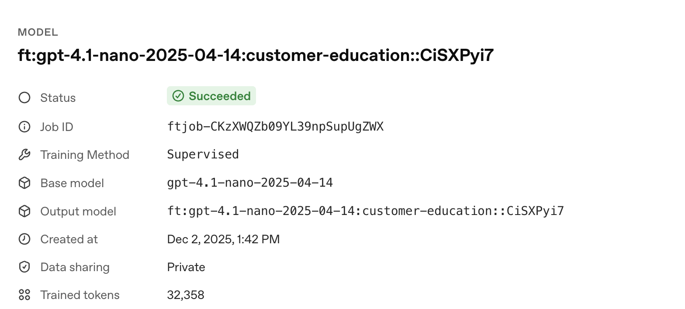

# Builder Bootcamp: Build and Evaluate a Fine-Tuned Model with Distillation

### Lab metadata

- **Lab type**: Guided, hands-on
- **Duration**: ~45-60 minutes
- **Level**: Advanced builders / Enterprise practitioners
- **Environment**: macOS/Windows/Linux terminal, Python 3.10+
- **Repo path**: `labs/lab04_finetuning_guided`
- **Last updated:** December 2, 2025

### Overview
In this lab, you will use OpenAI’s fine-tuning and evaluation APIs to build, distill, and benchmark a practical classification pipeline on real data. You will:
- **Prepare and explore** a labeled dataset for wine variety classification using the [Kaggle Wine Reviews corpus](https://www.kaggle.com/datasets/zynicide/wine-reviews).
- **Benchmark three base models** (gpt‑4.1, gpt‑4.1‑mini, gpt‑4.1‑nano) as strong, deployable baselines.
- **Generate teacher labels and distill expertise** by fine-tuning a smaller model (nano) using completions from a larger model (gpt‑4.1).
- **Evaluate accuracy uplift** by comparing the distilled model to your baselines with a robust, enterprise-aligned grading harness.

This lab is tightly focused to help you quickly master the essentials of preparing data, running baselines, orchestrating distillation, and quantifying model quality—all in the style of production enterprise workflows.

> **Note:** While the Evals, Agents, and RAG labs revolve around a customer support scenario, this lab uses a different example (wine classification) to illustrate fine-tuning and distillation patterns in a distinct, self-contained context.

### Learning objectives
By the end of this lab you will be able to:
1. Prepare a small, targeted classification dataset from a larger corpus for fine-tuning tasks.
2. Implement robust JSON parsing and test OpenAI models on classification responses.
3. Start, monitor, and analyze a distillation fine‑tuning job workflow.
4. Evaluate a distilled model against baselines using a shared criteria harness for comparison.

### Prerequisites
- **Python**: 3.10+ recommended
- **Dependencies**: `openai`, `pydantic`, `python-dotenv`
- **API key**: Environment variable `OPENAI_API_KEY`
- **Access**: Org/project must have access to File Search, Responses, and the Evals API (non‑ZDR workspace)

## Task 1: Set up your environment

> **Note:** If you've already set up your environment and installed the required dependencies as described in the main README or previous labs, you can skip these setup steps.

> **Tip:** For the easiest reading, open this README in **Markdown Preview** mode in your IDE (VSCode, Cursor, etc). It makes the instructions, tables, and code easier to read and scan. Some environments may need a markdown extension.

Let's get started by cloning the lab repository, setting up your Python virtual environment, and installing all the required libraries and dependencies you'll need for the RAG pipeline and evaluation tasks in this lab.

1. Run the following command to clone and enter the repository (repo root):
```bash
git clone https://github.com/openai-customer-education/builder-bootcamp.git
cd builder-bootcamp
```

<details>
<summary>Windows (PowerShell)</summary>

```powershell
git clone https://github.com/openai-customer-education/builder-bootcamp.git
Set-Location builder-bootcamp
```
</details>

2. Create and activate a virtual environment (Python 3.10+):
```bash
python3 --version
python3 -m venv .venv
source .venv/bin/activate
python -V
```

<details>
<summary>Windows (PowerShell)</summary>

```powershell
python --version
python -m venv .venv
.\.venv\Scripts\Activate.ps1
python -V
```
</details>

3. Now run the following commands to install dependencies:
```bash
python -m pip install --upgrade pip
pip install openai pydantic python-dotenv openai-agents kagglehub pandas
```

<details>
<summary>Windows (PowerShell)</summary>

```powershell
python -m pip install --upgrade pip
pip install openai pydantic python-dotenv openai-agents
```
</details>

**Checkpoint**: Run the following command to verify imports resolve:

```bash
python - << 'PY'
import sys
print('Python OK:', sys.version)
import openai
print('OpenAI OK:', getattr(openai, '__version__', 'unknown'))
from openai import OpenAI
print('Client OK:', bool(OpenAI))
PY
```

<details>
<summary>Windows (PowerShell)</summary>

```powershell
@'
import sys
print("Python OK:", sys.version)
import openai
print("OpenAI OK:", getattr(openai, "__version__", "unknown"))
from openai import OpenAI
print("Client OK:", bool(OpenAI))
'@ | python
```
</details>

**Expected output:**
```bash
Python OK: 3.10.x
OpenAI OK: x.y.z
Client OK: True
```

4. Set your API key for this terminal session:

```bash
export OPENAI_API_KEY=sk-...
```

<details>
<summary>Windows (PowerShell)</summary>

```powershell
$env:OPENAI_API_KEY = "sk-..."
```
</details>
> **Note:** Your instructors should supply you with a specific API key. You can also use your own.

**Checkpoint**: Confirm the key is set (prints a non‑empty value)

```bash
echo $OPENAI_API_KEY
```

<details>
<summary>Windows (PowerShell)</summary>

```powershell
Write-Output $env:OPENAI_API_KEY
```
</details>

*Expected output (example):*
```text
sk-proj-YGLzbhqeIJJ....NoA
```

With your environment ready, you will now get oriented with the lab's directory structure and key datasets.

## Task 2: Explore the lab files

Let’s take a moment to learn more about the files in this lab directory and get familiar with the datasets that we’ll be leveraging for this exercise.

### What’s in this lab directory

Here’s a quick overview of the main scripts and files you’ll use throughout this lab:

| File | Purpose | Output/Notes |
| --- | --- | --- |
| `step_00_prepare_data.py` | Download and prepare the dataset (France subset). | Writes `labs/data/wine_france_subset.csv`, `labs/data/varieties.json`. |
| `step_01_baseline_eval.py` | Evaluate three base models; you implement JSON parsing. | Writes per‑model JSONL; prints pass/total. |
| `step_02_store_completions.py` | Upload teacher JSONL and start a distillation job. | Prints file id, job id, distilled model. |
| `step_03_eval_distilled.py` | Evaluate the distilled model vs gold labels. | Prints pass/total and accuracy; creates an eval run. |
| `testing_criteria.py` | Grading criteria reused across steps. | Exact‑match string check. |

Take a moment to explore these files and flag any questions with your facilitators.

## Task 3: Prepare the dataset
This step downloads the Kaggle Wine Reviews dataset, filters to France, prunes rare varieties, and writes outputs to `labs/data/`. 

1. Open the `step_00_prepare_data.py` file and review the code to understand how the raw wine reviews dataset is filtered, labeled, and prepared.

2. Now run the following command to generate your working dataset:

```bash
python -m labs.lab04_finetuning_guided.step_00_prepare_data
```

**Expected output:**
```bash
Wrote subset CSV: /Users/.../builder-bootcamp/labs/data/wine_france_subset.csv
Wrote varieties JSON: /Users/slubbers/.../builder-bootcamp/labs/data/varieties.json
Rows: 500 | Varieties: 76
...
```

> **Note:** If you see a Kaggle auth error, ensure your Kaggle credentials are configured for `kagglehub` and retry.

After running the script, your output files will be written to the `labs/data` directory by default. If you want a larger or smaller sample for experimentation, you can adjust the `SAMPLE_SIZE` parameter (currently set to `500`) in the data preperation script.

**Checkpoint:** Run the following command to confirm your filtered CSV dataset is present and inspect the top rows:

```bash
head -n 2 labs/data/wine_france_subset.csv
```
**Expected output**

```bash
Unnamed: 0, country, description, designation, points, price, province, region_1, region_2, taster_name, taster_twitter_handle, title, variety, winery
97689, France, "Named after the French author who came from Provence, this wine is a bright, fruity style with pepper and caramel flavors. It has plenty of red fruits and attractive final acidity.", Colette, 87, 17.0, Provence, Côtes de Provence, , Roger Voss, @vossroger, La Belle Collection 2015 Colette Rosé (Côtes de Provence), Rosé, La Belle Collection
```

**Checkpoint:** Run the following command to confirm the wine varieties labels file exists and inspect its content:

```bash
ls labs/data/varieties.json && cat labs/data/varieties.json
```

**Expected output (truncated)**
```bash
  "varieties": [
    "Aligoté",
    "Alsace white blend",
    "Altesse",
    "Auxerrois",
    "Bordeaux-style Red Blend",
    "Bordeaux-style White Blend",
    "Braucol",
    "Cabernet Franc",
    ...
```

Now that you've created your working dataset, you’re ready to continue on to the next step.

## Task 4: Benchmark Baseline Models

Before fine-tuning, it's important to understand how well the base models perform on your dataset. In this task, you'll run three pre-built OpenAI models—gpt-4.1 (teacher), gpt-4.1-mini (student), and gpt-4.1-nano (nano)—on your dataset and inspect the outputs to establish a baseline for comparison.

1. Open `step_01_baseline_eval.py` in your editor.

2. Familiarize yourself with the script’s flow, which loads your prepared data, iterates over the dataset, calls each base model, and records predictions for grading. The key task is to predict the wine variety label using available metadata features.

3. Find the `classify_variety(...)` function and replace it's `“TODO”` section with the following so that it correctly calls an OpenAI model (via the Responses API) and parses the returned prediction:

```python
response = client.responses.create(
        model=model,
        input=[
            {
                "role": "system",
                "content": (
                    "Classify the wine variety from the provided fields. "
                    "Return ONLY a JSON object like {\"variety\": \"...\"} where the value "
                    "is one of the allowed enum values."
                ),
            },
            {"role": "user", "content": prompt},
        ],
    )
```

4. Now run the following command to benchmark the three base models on the same dataset:

```bash
python -m labs.lab04_finetuning_guided.step_01_baseline_eval
```

> **Note:** This command might take a few minutes to run.

> **Note:** You can adjust the run with the following environment variables:
> - `DATA_CSV` (input data path, defaults to `data/wine_france_subset.csv`)
> - `VARIETIES_JSON` (variety labels, defaults to `data/varieties.json`)
> - `TEACHER_MODEL`, `STUDENT_MODEL`, `NANO_MODEL` (model versions)
> - `NUM_ROWS` (dataset size limit, defaults to 100)

**Expected output (example)**

```bash
Rows to evaluate: 100 | #Varieties: 76

...

Evaluating TEACHER model: gpt-4.1
Teacher: 89/100 = 0.890

Evaluating STUDENT model: gpt-4.1-mini
Student: 58/100 = 0.580

Evaluating NANO model: gpt-4.1-nano
Nano: 49/100 = 0.490
```

Each model is run on the exact same dataset, predicting the wine variety label. The script evaluates accuracy using strict equality (model answer must match gold variety label). Baseline scores serve as reference points for all future improvement.

By completing this benchmarking step, you now have solid, reference-point accuracy for each OpenAI base model on your target task. This gives you a clear baseline to compare the impact of any future fine-tuning or distillation work.

Next, you'll harness the strongest model (gpt‑4.1) to generate “teacher” labels and kick off your model distillation workflow—further boosting performance within your dataset’s constraints.

## Task 5: Start and poll the distillation job (nano)

In this task, you'll use the predictions generated by your teacher model (gpt‑4.1) to create a pseudo-labeled dataset. You’ll then kick off a distillation fine-tuning job, training a compact student model (gpt‑4.1-nano) to mimic the teacher. This is a core method for deploying high-accuracy models within efficiency, budget, or latency constraints.

1. Open `step_02_store_completions.py` in your editor.

2. Familaize yourself with the script's flow, which will upload your latest completions file (JSONL) produced by the teacher model, start a fine-tuning job using the nano model as the base, and poll until the job completes and print out the new model’s name.

3. 

```python
job = client.fine_tuning.jobs.create(
    training_file=file_id,
    model=NANO_MODEL,      # e.g., "gpt-4.1-nano-2025-04-14"
    suffix=JOB_SUFFIX,     # optional
)
print(f"Started job: {job.id}")
```

4. Start the distillation job by running the following command:

```python
python -m labs.lab04_finetuning_guided.step_02_store_completions
```
> **Note:** Fine-tuning jobs can take anywhere from a few minutes to 15 minutes or more, depending on queue times and dataset size. This is normal—don’t be alarmed if your job takes a while to complete or show as "finished" in the console.

> **Note:** You can adjust the run with the following environment variables:
> - `COMPLETIONS_JSONL` (optional), if omitted, the script auto-discovers the latest `labs/data/completions_teacher_*.jsonl`
> - `NANO_MODEL` (default: gpt-4.1-nano-2025-04-14)
> - `JOB_SUFFIX` (optional job name add-on)

**Expected output (example)**

```bash
Prepared fine‑tune file with 100 item(s): /Users/.../builder-bootcamp/labs/data/finetune_dataset_20251202T214225Z.jsonl
Uploaded training file id: file-UEWXGdS432AEq4ab76uFup
Started job: ftjob-CKzXWQZb09YL39npSupUgZWX
Polling fine‑tune job: ftjob-CKzXWQZb09YL39npSupUgZWX
Status: validating_files | Model: None
Status: running | Model: None
...
Status: succeeded | Model: ft:gpt-4.1-nano-2025-04-14:customer-education::CiSXPyi7
Distilled model name: ft:gpt-4.1-nano-2025-04-14:customer-education::CiSXPyi7
...

```

The script will automatically poll this job id and print the distilled model name on success. Soon after, you should see output confirming a file upload, the job start, and (once finished) your new model’s name.

6. Now run the following command to store your distilled model name, replacing `"your-distilled-model-name"` with the actual model name printed at the end of the previous step (shown after "Distilled model name: ..." in the script output):

```bash
export DISTILLED_MODEL="your-distilled-model-name"
```

Windows (Powershell)
```powershell
$env:DISTILLED_MODEL = "your-distilled-model-name"
```

### Optional: Review your fine-tuning job in the OpenAI Console

If you want more visibility into your fine-tuning job’s progress and results:

1. Go to [OpenAI's Fine-tuning dashboard](https://platform.openai.com/finetune/) in your browser.

2. You should see your job listed with its model name, submission time, and current status.

3. Click on the job to see more details, including logs, error messages, completion progress, and hyperparameter settings (similar to below).



This dashboard is useful if your job seems stalled, you want to monitor multiple jobs, or just want to explore the fine-tuning process visually.

---

## Task 6: Evaluate the Distilled Model

Now it’s time to test how well your fine-tuned (distilled) student model performs. In this task, you’ll use the same evaluation harness from earlier to benchmark your new model’s accuracy and compare it directly to your baseline results. 

More specifically, you'll run the distilled model on the evaluation dataset, measure its accuracy using the same exact criteria as in Task 4, and compare distilled results to your baselines in your script output and on the OpenAI Evaluations dashboard.

1. Ensure you’re exported distilled model name is still available as an environment variable:

```bash
echo $DISTILLED_MODEL
```

Windows (Powershell)
```powershell
Write-Output $env:DISTILLED_MODEL
```

2. Run the following command to launch the evaluation against your test data:

```bash
python -m labs.lab04_finetuning_guided.step_03_eval_distilled
```

> **Note:** It might take a few minutes for this command to run.

> **Note:** You can adjust the run with the following environment variables:
>  - `DATA_CSV`
>  - `VARIETIES_JSON`
>  - `NUM_ROWS`

**Expected output (example)**

```
Rows to evaluate: 100 | #Varieties: 12
Evaluating DISTILLED model: ft:gpt-4.1-nano-2025-04-14:customer-education::CiSXPyi7
Distilled: 84/100 = 0.840
```

The lab uses a module called `testing_criteria` (found in `labs/lab04_finetuning_guided/testing_criteria.py`) to define how predictions are evaluated. This module contains a `score_model` grader that checks for exact string matches between the model's answer and the gold label, as well as a deterministic `string_check` function that specifically enforces that the `model_answer` is identical to the variety label. Both your baseline (Task 4) and distilled (Task 6) runs create per-row JSONL files (with `input`, `variety`, and `model_answer`) and compute final accuracy according to these strict criteria.


### Optional: Visually Compare Results in the Evaluations Dashboard

For a more interactive comparison, you can use the OpenAI Evaluations dashboard.

1. Go to the [Evaluations dashboard](https://platform.openai.com/evaluation?tab=evals) in your browser.

2. You’ll see runs listed for your teacher, student, and distilled models. 

3. Click on the distilled run to inspect detailed accuracy results, class breakdowns, and outputs side-by-side. 


This dashboard is a great way to compare your models’ performance beyond the script output and spot patterns or mistakes at-a-glance.

## Conclusion

### Wrap‑Up
In this lab, you distilled a larger OpenAI model into a smaller one and benchmarked the results. You:
1. Prepared and explored a targeted wine classification dataset.
2. Implemented robust parsing and benchmarked three base models as baselines.
3. Generated high-quality teacher labels and ran a distillation fine‑tune job.
4. Evaluated your distilled model alongside the baselines, using a consistent accuracy harness.

**Checkpoint:** To receive credit for this lab, show your distilled model’s evaluation output (either in the console or via the OpenAI Evaluations dashboard) to a facilitator.

### Discussion Prompts
Reflect on your work and consider the following:
- **Label quality:** How did the accuracy of your teacher labels influence the distilled model’s performance?
- **Parsing robustness:** Which code changes made classification parsing safer, and how would you extend them for larger-scale or messier data?
- **Production readiness:** What accuracy threshold and evaluation criteria would you require before deploying this workflow?

### Troubleshooting
If you encounter issues, consider these common problems and solutions:
- **Kaggle download fails:** Ensure `kagglehub` is installed and your Kaggle credentials are configured properly.
- **Missing API key:** Run `export OPENAI_API_KEY="sk-..."` and confirm with `echo $OPENAI_API_KEY`.
- **Model evaluation unexpectedly low:** Verify your label files and predictions, and check for parsing errors or misaligned test/train data.
- **Rate limits or long run times:** Reduce `NUM_ROWS` or confirm dataset size before running large batches or fine-tunes.
- **File not found:** Double-check that `labs/data/wine_france_subset.csv` and `labs/data/varieties.json` were created and that your paths are correct.

---
