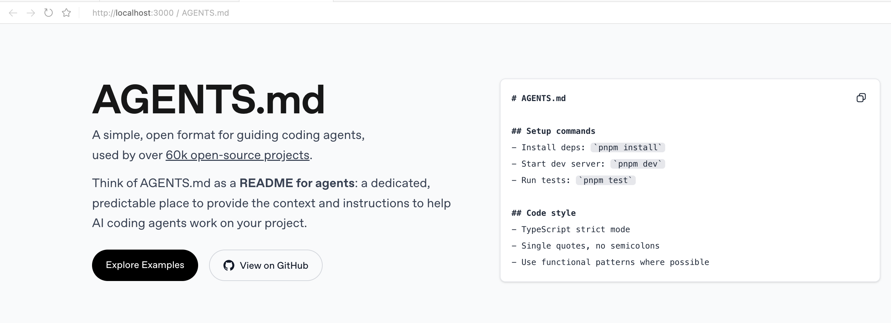
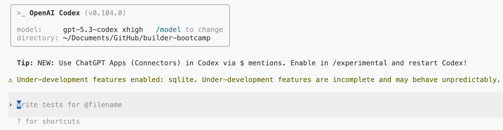
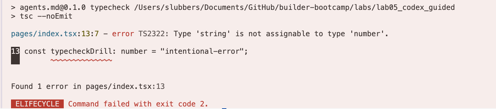
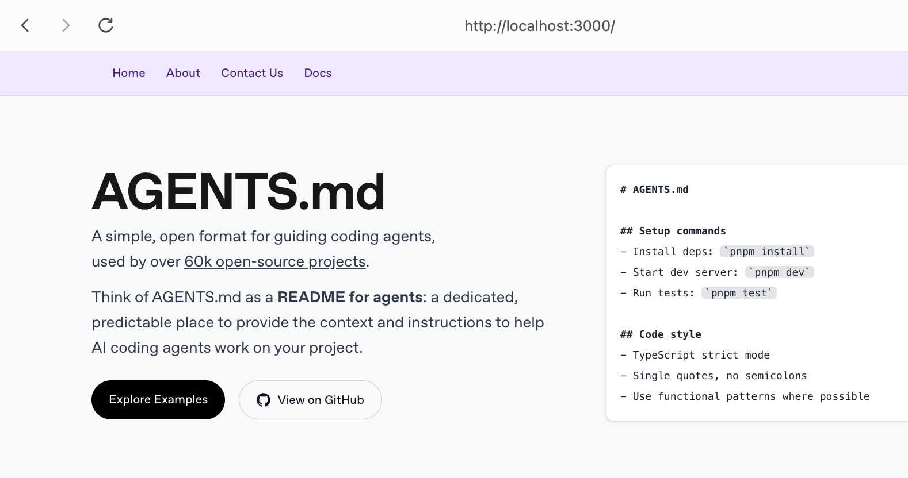
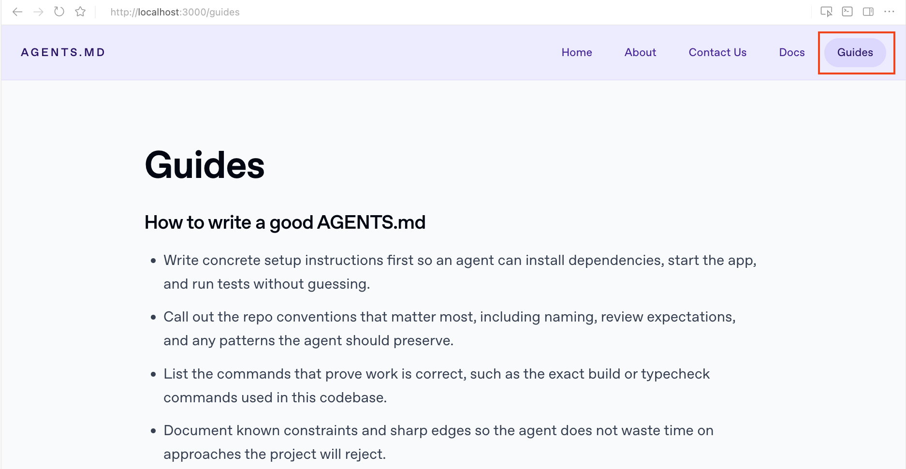

# Builder Bootcamp: Codex Challenge Lab

### Lab Metadata
- **Lab type**: Hands-on challenge
- **Duration**: ~60 minutes (with optional stretch time)
- **Level**: Advanced builders
- **Environment**: macOS/Linux terminal, Node.js + pnpm, Codex CLI
- **Repo path**: `labs/lab05_codex_challenge`
- **Last updated:** February 25, 2026

## Overview

This is the challenge version of the Codex lab. You will plan, implement, validate, and iterate in a real Next.js codebase with minimal scaffolding.

Unlike the guided version, this lab is intentionally open-ended: you are responsible for writing effective prompts, defining repository conventions, choosing validation steps, and keeping changes scoped and reviewable. The goal is to demonstrate strong Codex-assisted development judgment by yourself rather than following a complete, fixed sequence of commands.

> **Note:** Getting stuck?
>
> Work the challenge first. If you need hints or a reference path:
> - Use the checkpoints in this README to narrow the issue.
> - Compare your approach to the guided version at `labs/lab05_codex_guided/`.
> - Ask a facilitator to review your prompts, repo guidance, or validation plan.

## Tasks at a glance

In this challenge lab, you will complete the following tasks:

1. Set up the environment, authenticate Codex, run the baseline app locally, and capture a read-only repo map.
2. Use plan mode to propose implementation options with files, sequence, and risks/tradeoffs.
3. Create repo guidance in `AGENTS.md` to improve Codex planning and execution quality.
4. Create `.codex/config.toml` defaults for consistent model/profile behavior.
5. Add a shared `typecheck` validation command and verify it works.
6. Implement a scoped product request (global navbar + new pages) and validate the result.
7. Create and use a reusable Skill to add a `/guides` page with validation and handoff output.
8. Stretch: prototype a standalone interactive experience without modifying the main lab app.

### How to work through this lab

- Work from the clean starter app in this folder.
- Use Codex to generate plans and implementations, but validate outputs yourself.
- Keep a record of the prompts you use (especially for Tasks 6–8) so facilitators can review your decision-making.
- Use the checkpoints to confirm you are on track before moving on.

## Objectives

By the end of this lab, you’ll prove you can:
1. Configure Codex for safe, consistent execution in a real repository (`AGENTS.md`, `.codex/config.toml`, validation commands).
2. Use Codex for repo understanding, planning, and scoped implementation without losing control of the change surface.
3. Build repeatable workflows using Skills and structured output requirements.
4. Prototype quickly while maintaining isolation boundaries and validating behavior before handoff.

## Scenario: Internal Web Experience Team

You are a builder on an internal web experience team responsible for shipping small product and documentation updates across a shared Next.js site. Your team is adopting Codex to accelerate implementation while preserving code quality and predictable review workflows.

**Your mission**
- Use Codex to define repo rules, plan changes, implement a scoped feature, and deliver review-ready outputs.
- Demonstrate that you can move quickly without destabilizing the app or bypassing validation.

**The challenge**
- Deliver multiple changes in **< 60 minutes** while keeping diffs scoped and easy to review.
- Build repeatable conventions (`AGENTS.md`, config defaults, validation commands, a reusable Skill) that improve future Codex sessions.
- Stretch beyond simple UI/content edits by creating a standalone interactive prototype without touching the main app.

**What success looks like**
- Codex plans are grounded in repo-specific files and commands.
- Feature work ships with clear validation and manual smoke checks.
- A reusable Skill successfully drives a second implementation.
- Stretch prototype work is isolated from the main application.

## Task 1. Set up, authenticate, run locally, and explore with Codex

In this task, you will establish a working baseline (environment + Codex access) and produce an initial repo map before making any edits.

**Tasks**
1. Install dependencies and run the app locally from `labs/lab05_codex_challenge`.
2. Authenticate Codex in your environment.
3. Start Codex from this lab folder.
4. Run one read-only repo analysis prompt that maps architecture, entrypoints, commands, and top risks.
5. Record likely edit surfaces: `pages/`, `components/`, `styles/globals.css`, `package.json`.

**Checkpoint 1:** You should see your application load (usually on `http://localhost:3000`, or the next available port) and resemble the following:




**Checkpoint 2:** Capture one successful Codex output in this repo:



## Task 2. Design implementation options in plan mode

**Do this in Codex:**
1. Use plan mode to generate implementation options.
2. Ask for a navbar + pages implementation plan.
3. Require:
- exact files
- ordered steps
- risk/tradeoff notes
- validation commands
4. Capture the selected plan in a new file `labs/lab05_codex_challenge/output.txt`.

**Checkpoint:** You have one plan output with files, sequence, risks, and validation commands, saved in `labs/lab05_codex_challenge/output.txt`.

## Task 3. Create repository guidance (`AGENTS.md`)

**Goal:** Create a repo-specific operating contract that improves Codex planning and implementation quality in this codebase.

**Where to work:** `labs/lab05_codex_challenge/AGENTS.md`

**Challenge requirements:** Your `AGENTS.md` must include:
- A short project summary
- Key entrypoints (specific paths)
- Dev workflow commands
- Validation workflow commands
- Guardrails / things to avoid during interactive sessions
- Definition of Done (objectively checkable)

Suggested areas to cover:
- small diffs
- iterative dev-server workflow
- no unnecessary build steps during interactive work
- validation + smoke checks before handoff

**How to test and run:**
1. Write `AGENTS.md`
2. Run a prompt without explicit AGENTS compliance
3. Run a similar prompt that asks Codex to strictly follow `AGENTS.md`
4. Compare the output quality/specificity
5. Append Task 3 findings to `labs/lab05_codex_challenge/output.txt` (what changed, plus at least 2 observed output differences).

**Checkpoint:**
- `AGENTS.md` exists and includes all required sections.
- You can point to at least 2 differences showing `AGENTS.md` improved plan quality (for example: better validation steps, stronger guardrails, more repo-specific file references).
- `labs/lab05_codex_challenge/output.txt` includes your Task 3 findings.

**Expected outcome:** Codex outputs become more operational and repo-specific when guided by your `AGENTS.md`.

## Task 4. Create Codex defaults (`.codex/config.toml`)

**Goal:** Define stable repo-local Codex defaults using one required baseline and two named profile overrides.

**Where to work:** `labs/lab05_codex_challenge/.codex/config.toml`

**Challenge requirements:** Define the following behaviors in `.codex/config.toml`:
- A top-level default that uses the standard Codex model for core work with an approval policy appropriate for normal interactive use.
- A `deep-review` profile for slower, higher-reasoning review and validation work.
- A `lightweight` profile for faster, cheaper low-risk tasks.

For config key names and additional options, see the [Codex advanced config reference](https://developers.openai.com/codex/config-advanced).

**How to test and run:**
1. Create `.codex/config.toml`
2. Start Codex in the lab directory and confirm the default model/approval behavior are applied.
3. Start Codex with `deep-review` and `lightweight` and confirm the active behavior changes as expected.
4. Append Task 4 findings to `labs/lab05_codex_challenge/output.txt` (default model, approval policy, profiles tested, observed behavior).

**Checkpoint:**
- Config file is valid and readable
- Default behavior is applied in a normal session
- `deep-review` and `lightweight` both work as expected
- `labs/lab05_codex_challenge/output.txt` includes your Task 4 findings.

**Expected outcome:** You can reliably switch Codex behavior by repo and by profile without reconfiguring each session manually.

## Task 5. Add and validate a `typecheck` script

**Goal:** Standardize a reusable TypeScript validation command so Codex plans and humans both reference the same check.

**Where to work:** `labs/lab05_codex_challenge/package.json`

**Challenge requirements:**
- Integrate a reusable `typecheck` command into the repo scripts.
- Make sure it is appropriate for fast validation in this TypeScript codebase.
- Verify the command exists before relying on it in prompts/plans.
- Run the command successfully after your change.

**How to test and run:**
1. Run `pnpm typecheck`.
2. Temporarily introduce a small type mismatch in `pages/index.tsx`.
3. Confirm `pnpm typecheck` catches it.
4. Remove the temporary drill line and rerun `pnpm typecheck`.

**Checkpoint 1:** `pnpm typecheck` should catch the intentional mismatch:



**Checkpoint 2:**
- `package.json` contains a working `typecheck` script.
- `pnpm typecheck` runs from the lab directory.
- Codex plans reference `pnpm typecheck` when you ask for validation steps.

**Expected outcome:** The repo now has a consistent type validation command that can be reused across tasks and handoff criteria.

## Task 6. Implement a scoped product request

**Goal:** Deliver a small product request cleanly, keep the diff reviewable, and make sure the result matches the expected UI.

**Where to work:** `pages/`, `components/`, and any minimal supporting files required by your implementation

**Treat this as the request you received from the product team:**
- Add a global navbar visible on all pages.
- Add:
  - `components/NavBar.tsx`
  - `pages/about.tsx`
  - `pages/contact.tsx`
  - `pages/docs/index.tsx`
- Navbar links: Home, About, Contact Us, Docs.
- Each page includes one `<h1>` and 2-4 short paragraphs.
- Layout remains usable on narrow screens.
- Ensure the navbar is set to a soft purple color.

**Challenge constraints:**
- Keep diffs focused; avoid unrelated refactors.
- Record files changed, assumptions, validation commands run, and a short manual smoke checklist.
- Validate after applying the patch.

**How to test and run:**

```bash
pnpm typecheck
pnpm dev
```

Then manually verify `/`, `/about`, `/contact`, and `/docs` load and the navbar appears consistently.

**Checkpoint 1:** The UI should resemble the following (including the soft purple navbar):



**Checkpoint 2:**
- Feature is implemented and visible in the UI
- Routes load correctly from the navbar
- Validation passes (`pnpm typecheck`; `pnpm lint` if your local lint setup is working)

**Expected outcome:** You can deliver a scoped UI feature from a concrete product request with clear validation and smoke-test notes.

## Task 7. Create and use a reusable Skill

**Goal:** Package a repeatable page-delivery workflow into a Skill and use it to implement a new `/guides` page.

**Where to work:** `labs/lab05_codex_challenge/.codex/skills/add_new_page/SKILL.md` and app files updated by the skill

**Challenge requirements:**
- Create a Skill for “add a new page end-to-end”
- Include clear purpose, expected inputs, workflow, and required outputs
- Use the Skill to add a `Guides` page and update navigation
- Require validation + handoff output in the Skill contract

**How to test and run:**
1. Create the skill file
2. Start Codex and confirm the skill appears in `/skills`
3. Invoke the skill to add `/guides`
4. Validate and smoke-test the result (`pnpm typecheck`, plus `pnpm lint` if available)

**Checkpoint 1:** The `/guides` page should resemble the following:



**Checkpoint 2:**
- Skill is recognized in Codex
- `/guides` is implemented through the skill workflow
- Navbar includes `Guides`
- Handoff output includes validation summary and residual risks

**Expected outcome:** You can codify a repeatable Codex workflow and reuse it to produce consistent, reviewable changes.

## Task 8. Stretch: standalone interactive prototype (isolated)

**Goal:** Use Codex for an ambitious interactive prototype while preserving a strict isolation boundary from the main lab app.

**Where to work:** `labs/lab05_codex_challenge/standalone/flight-sim` (new folder created during this task)

**Challenge requirements:**
- Build a runnable standalone prototype (for example, a small Three.js flight-simulator concept)
- Keep changes isolated to `standalone/flight-sim`
- Do **not** modify the main lab app (`pages/`, `components/`, `styles/`, or the lab root `package.json`)
- Document run instructions, known limitations, and one follow-up improvement iteration

**How to test and run:**
- Follow the run instructions returned by Codex for the standalone app
- Confirm the scene/prototype loads and basic controls/interactions work
- Run a scope check from the lab root:

```bash
cd ~/Documents/GitHub/builder-bootcamp/labs/lab05_codex_challenge
git diff --name-only
```

**Checkpoint 1:** The standalone prototype should resemble the following:


**Checkpoint 2:**
- Standalone prototype runs locally
- Main app remains untouched by this task (changes isolated to `standalone/flight-sim`)
- You completed at least one targeted iteration (visuals, controls, HUD, or feedback)

**Expected outcome:** You can use Codex for fast prototyping without sacrificing scope control in the main product codebase.

## Conclusion

### Wrap-Up
In this challenge lab, you executed a full Codex-assisted development workflow with minimal scaffolding:
1. Verified local runtime/tooling and authenticated Codex
2. Used read-only analysis and `/plan` to map the repo and shape implementation strategy
3. Authored repo/runtime conventions (`AGENTS.md`, `.codex/config.toml`, `typecheck`) for consistent execution
4. Implemented a scoped product request and validated behavior locally
5. Created and used a reusable Skill for repeatable page delivery
6. Ran an isolated stretch prototype workflow without destabilizing the main app

**Checkpoint:** To complete the challenge lab, demonstrate all of the following to a facilitator:
- `AGENTS.md` + `.codex/config.toml` created and used
- `typecheck` script added and runnable
- navbar + `/about`, `/contact`, `/docs` feature shipped
- `/guides` page delivered via your Skill
- (stretch) standalone prototype isolated from the main app

### Discussion Prompts
- Prompting strategy: Which prompt structures produced the most reliable Codex behavior in this repo, and why?
- Governance: Which rules belong in `AGENTS.md` vs `.codex/config.toml` vs task-specific prompts?
- Reuse: Which additional Skills would create leverage for your real team workflows?

### Troubleshooting
- `pnpm` not found:
  - Install with `npm i -g pnpm@latest`, then verify with `pnpm -v`.
- `codex` not found:
  - Install with `npm i -g @openai/codex`, then verify with `codex --version`.
- Codex authentication issues:
  - Retry `codex login` (browser sign-in) or verify `OPENAI_API_KEY` before key-based login.
- `pnpm typecheck` fails unexpectedly:
  - Check for temporary drill code left in `pages/index.tsx` or feature regressions introduced in later tasks.
- `pnpm lint` / `next lint` fails in this bundle:
  - This lab uses a Next.js 16 bundle; continue with `pnpm typecheck` + manual smoke checks unless your local environment has a working lint setup.
- Skill does not appear in `/skills`:
  - Verify the path and frontmatter at `.codex/skills/add_new_page/SKILL.md`.
- Stretch task modifies the main app:
  - Reject the patch, restate the isolation boundary (`standalone/flight-sim` only), and rerun with stricter file-scope constraints.
