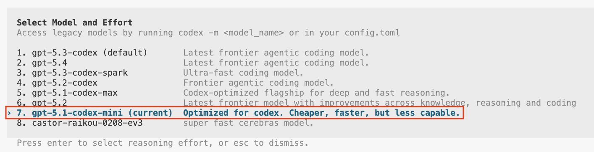
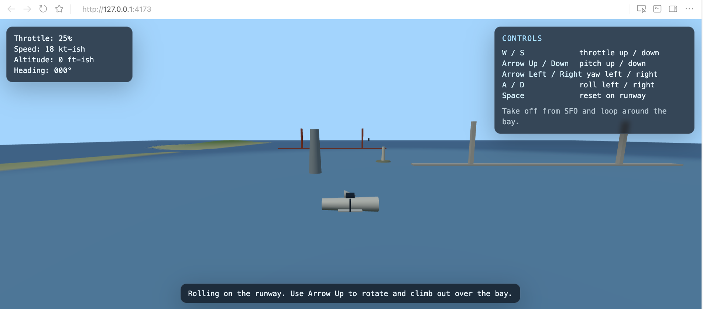

# Builder Bootcamp: Plan, Build, and Ship with Codex

### Lab Metadata

- **Lab type**: Guided, hands-on
- **Duration**: ~60 minutes
- **Level**: Advanced builders
- **Environment**: macOS/Linux terminal, Node.js + pnpm, Codex CLI
- **Repo path**: `labs/lab05_codex_guided`
- **Last updated:** February 18, 2026

### Overview
In this lab, you will use Codex to plan, build, and deliver real code changes in an existing Next.js repository. You will:
- **Create core collaboration artifacts**, such as `AGENTS.md`, `.codex/config.toml` settings, and plan mode.
- **Use Codex interaction modes** for read-only analysis, plan mode, single-shot execution, and iterative prototyping.
- **Create and use a reusable Skill** for repeatable page-delivery workflows.
- **Validate outputs** with lint/typecheck and manual smoke checks.

This lab is intentionally practical. It is designed to reflect how builders work with Codex agents in production-style repos: defining constraints, leveraging plan mode and features, and shipping scoped changes rapidly.

### Learning Objectives
After completing this lab, you will be able to:

1. Set up Codex CLI, authenticate with the right method, and run the app locally while keeping your shell usable.
2. Use read-only prompts and plan mode to map the codebase, identify target files, and compare implementation options before editing.
3. Configure repository execution standards (`AGENTS.md` + `.codex/config.toml`) and verify they change how Codex plans and operates.
4. Implement features with single-shot and iterative workflows while keeping diffs scoped and reviewable.
5. Create and apply a reusable skill, then deliver PR-ready outputs with validation (`pnpm lint`, `pnpm typecheck`) and handoff notes.

### Prerequisites
- **Codex CLI**: Installed and available in PATH (`codex --version`)
- **Runtime**: Node.js installed (`node -v`)
- **Package manager**: `pnpm` installed (`pnpm -v`)
- **Authentication**: ChatGPT sign-in (`codex login`) or API key (`OPENAI_API_KEY`)
- **Access**: Account/workspace must have Codex access enabled
- **Repository**: Local copy of `builder-bootcamp` with access to `labs/lab05_codex_guided`

> **Note:** This lab is written for the Codex CLI. The macOS app and web app are valid alternatives, but the commands below are the canonical path.

## Task 1. Set up your environment

> **Tip:** Open this file in Markdown Preview mode for easier scanning during the lab.

In this task, you will verify dependencies, authenticate Codex, and run the app. The app is a small Next.js microsite used as the working codebase for Codex planning, editing, validation, and handoff workflows.

1. Move into this lab directory:
```bash
cd ~/Documents/GitHub/builder-bootcamp/labs/lab05_codex_guided
```

2. Verify Node.js, npm, and pnpm are installed:
```bash
node -v
npm -v
pnpm -v
```

*Expected output:*
```text
v22.10.0
10.9.0
9.15.1
```

If `pnpm` is missing:
```bash
npm i -g npm@latest
npm i -g pnpm@latest
```

3. Install the Codex CLI and verify version:
```bash
npm i -g @openai/codex
codex --version
```

4. Authenticate using one method:

Method A (recommended in most bootcamp settings):
```bash
codex login
```
*Expected output:* Codex opens a browser sign-in flow and confirms login in the terminal when authentication completes.

Method B (API key mode, if your environment uses API credentials):
```bash
export OPENAI_API_KEY=sk-...
echo "$OPENAI_API_KEY"
printenv OPENAI_API_KEY | codex login --with-api-key
```

5. Now that our dependencies are installed, let's ensure we're in the correct lab directory before starting the app:
```bash
cd ~/Documents/GitHub/builder-bootcamp
cd labs/lab05_codex_guided
```

6. Install the necessary packages and start the development server (ideally in a separate terminal tab/window so your main shell stays available for Codex commands):
```bash
pnpm install
pnpm dev
```

**Checkpoint:** You should see your application load (usually on `http://localhost:3000`, or the next available port) and resemble the following:


Now that the environment is ready and your application up and running, you're ready to explore the repo with read-only Codex prompts before making changes.

## Task 2. Explore the lab files and repo with Codex & plan mode

In this task, you will run read-only prompts to validate that Codex correctly understands the codebase and change surface.

This app is a small Next.js customer-support style microsite that we will extend during the lab. Instead of manually mapping the repo first, you will use Codex to quickly surface architecture, entrypoints, commands, and risk areas before making edits.

1. Start Codex from the lab path:
```bash
cd ~/Documents/GitHub/builder-bootcamp/labs/lab05_codex_guided
codex
```

2. Run this prompt:
```text
Read-only analysis only (no edits). Explain this repository in 6 bullets:
1) architecture style
2) key entrypoints
3) dev command
4) validation commands
5) likely first feature to build
6) biggest implementation risk
```

**Expected output:** 

```text
• 1. Architecture style: Next.js 16 + React 19 + TypeScript, using the Pages Router (pages/) with mostly presentational section components...
• 2. Key entrypoints: pages/index.tsx (main landing page + GitHub contributor fetch), pages/_app.tsx (global CSS, shared <Head>, analytics)...
• 3. Dev command: pnpm dev (script runs next dev --turbopack; install first with pnpm install)...
• 4. Validation commands: pnpm lint (and, after Task 5, pnpm typecheck / tsc --noEmit)...
• 5. Likely first feature to build: A global navbar + new pages (/about, /contact, /docs) by adding components/NavBar.tsx...
• 6. Biggest implementation risk: Sitewide UI regression when introducing global layout/nav through pages/_app.tsx...
```

Codex should return six concise bullets similar to the above that reference paths and commands. You now have a fast, file-level map of where changes belong and what checks matter before touching code.

Now we'll switch into plan mode and ask for implementation options. Plan mode is for structured pre-implementation thinking (files, order of operations, risks), not direct editing. You will reuse this planning pattern in later implementation tasks.

Some best practices for plan mode:
- State scope and non-goals explicitly.
- Ask for exact files and ordered implementation steps.
- Ask for risk levels and rollback notes for each step.
- Require concrete validation commands in the plan.
- Iterate on plan quality before making edits.

3. Put Codex into plan mode using `/plan`, then run:

```text
Add a global navbar and pages for About, Contact, and Docs, list exact files to change and why. Suggest a few different implementation plans.
```

**Expected output:** 

```
# Plan: Global Navbar + About/Contact/Docs Pages (Next.js Pages Router)

  ## Summary

  Add a site-wide navbar rendered from pages/_app.tsx, then create three routes: /about, /contact, and /docs. Keep implementation consistent with existing Tailwind + component style, and validate with lint/typecheck + manual smoke checks.

  ## Current State (Grounded)

  - Routing is Pages Router (pages/), with only pages/index.tsx, pages/_app.tsx, and pages/_document.tsx.
  - Shared UI is in components/.
  - Global styles are in styles/globals.css.
  - No existing navbar component or additional content pages yet.

  ... 

  ### Option 3 (Most Extensible)

  - Files: components/NavBar.tsx, components/SiteLayout.tsx, pages/_app.tsx, pages/about.tsx, pages/contact.tsx, pages/docs/index.tsx, optional styles/globals.css.
  - Approach: add layout wrapper component (SiteLayout) that includes navbar and page container.
  - Pros: strong foundation for future footer/sidebar/theming per page shell.
  - Cons: extra abstraction for current scope.

  ... 
```

Codex should propose multiple implementation paths similar to the above that include exact files, rationale, execution order, and risks/tradeoffs. You now have a concrete, reviewable implementation plan before starting edits.

4. After reviewing the plan output, press `Esc` to return to the normal Codex input mode.

You should now be back at the standard prompt (not in plan mode), ready to continue to the next task.

5. Optional (recommended): run a reusable structured planning prompt:
```text
Build a 4-step implementation plan for this improvement:
Add active-link styling in the navbar.

For each step include:
- exact files
- risk level (low/medium/high)
- validation commands
- rollback note if step fails
```

**Expected output:** A four-step plan with file-level actions, risks, validation commands, and rollback notes.

**Checkpoint:** You should now have both outputs captured:
- a 6-bullet read-only repository map
- a plan-mode implementation proposal with file-level steps and tradeoffs
- an optional structured 4-step plan with risks and rollback notes

With a baseline understanding of the codebase and planning commands, you are now ready to define repository-level execution rules.

## Task 3. Create repository guidance (`AGENTS.md`)

`AGENTS.md` is a repo-level instruction contract that Codex uses to understand how work should be done in this codebase. It defines preferred commands, boundaries, and quality gates so Codex outputs are grounded in your team workflow instead of generic defaults. This is one of the highest-leverage setup steps you can take since it directly improves planning quality and implementation reliability.

Some best practices for building `AGENTS.md` files:
- Keep instructions repo-specific rather than generic, so Codex can anchor plans and edits to your actual project structure and workflows.
- Include both positive instructions (what to do) and explicit guardrails (what to avoid), so behavior is predictable during implementation.
- Define done criteria that are objectively checkable (for example, named validation commands and required handoff artifacts), so completion is not ambiguous.
- Keep the document concise and operational, so it is easy to maintain and easy for Codex to follow consistently.

This lab starts without an `AGENTS.md` file. You will now create it with concrete repo instructions that Codex can apply in every later task.

1. Back in your CLI, run this command to write `AGENTS.md` with project context, key entrypoints, workflows, guardrails, and done criteria:

```bash
cat > ~/Documents/GitHub/builder-bootcamp/labs/lab05_codex_guided/AGENTS.md <<'EOF'
# AGENTS.md

## Project summary
This repo is a small Next.js (Pages Router) site used for Codex collaboration exercises.
Optimize for small, reviewable diffs and fast dev-server iteration.

## Key entrypoints
- `pages/index.tsx`
- `pages/_app.tsx`
- `components/`
- `styles/globals.css`

## Dev workflow
- `pnpm install`
- `pnpm dev`

## Validation workflow
- `pnpm lint`
- `pnpm typecheck`

## Agent guardrails
- Use the dev server for iterative changes.
- Do not run `pnpm build` during interactive agent sessions.
- Keep diffs small and scoped.
- If dependencies change: update lockfile and restart dev server.

## Definition of Done
- `pnpm lint` and `pnpm typecheck` pass
- Manual smoke checks are documented
- PR summary and test plan are ready
EOF
```

This creates the operating contract Codex will follow in this repo: where to edit, which commands to run, what to avoid during interactive sessions, and what must be true before a task is considered complete.

**Checkpoint:** ensure the file has been written with the expected sections:
```bash
sed -n '1,160p' ~/Documents/GitHub/builder-bootcamp/labs/lab05_codex_guided/AGENTS.md
```

You should see the sections `Project summary`, `Key entrypoints`, `Dev workflow`, `Validation workflow`, `Agent guardrails`, and `Definition of Done`.

Now let's see `AGENTS.md` in action by comparing two Codex prompts.

2. Run the following command to get into Codex input mode:

```bash
codex
```

3. First run this prompt:
```text
Propose a plan to add a /guides page.
```

**Expected output:** 

```bash
• 1. Confirm scope for /guides: static landing page vs. list of guide items (title, summary, link, tags).
  2. Inspect existing patterns in pages/index.tsx, pages/_app.tsx, components/, and styles/globals.css so /guides matches current layout/navigation.
  3. Create pages/guides.tsx with a simple, typed structure:
      - page heading + intro
      - guide list/grid (start with hardcoded data for small diff)
      - basic SEO tags via next/head
  4. Add minimal reusable UI only if needed (for example components/GuideCard.tsx) and keep styling scoped/small.
  5. Add an entry point to reach /guides (home page link or shared nav, depending on current app pattern).
  6. Validate with pnpm lint and pnpm typecheck, then run a quick manual smoke check in pnpm dev (/ and /guides load, links work, mobile layout looks sane).
  7. Prepare PR notes: what changed, why, and test plan/results.
```

4. Now run this prompt:
```text
Propose a plan to add a /guides page and strictly follow AGENTS.md, including validation and done criteria.
```

**Expected output:**

```bash
  1. Read current app structure and patterns in pages/index.tsx, pages/_app.tsx, components/, and styles/globals.css to keep /guides consistent and the diff small.
  2. Start iterative workflow with pnpm dev and keep it running while implementing.
  3. Add pages/guides.tsx as a Pages Router route with minimal scope:
      - Page title/intro
      - Simple guide list (hardcoded data first for a small, reviewable diff)
      - Basic semantic markup and light styling aligned with existing globals/components

  ... 

  Strict AGENTS.md compliance

  1. Use dev server for iteration.
  2. Do not run pnpm build.
  3. Keep changes small and scoped.
  4. Meet Definition of Done before finishing:
      - pnpm lint passes
      - pnpm typecheck passes
      - Manual smoke checks are documented
      - PR summary and test plan are ready
```

Spot the differences between prompt A and B. With `AGENTS.md`, Codex should be more concrete, constrained, and directly aligned to this repository.

**Checkpoint:** You created `AGENTS.md` and verified that Codex outputs become more repo-specific and operational when you explicitly require `AGENTS.md` compliance.

Now that repository guidance is both defined and validated, you will set Codex runtime defaults so sessions stay consistent across model selection, approval behavior, and profile usage.

## Task 4. Create Codex default settings (`.codex/config.toml`)

The `.codex/config.toml` file is a repo-level runtime configuration that Codex reads for model defaults, approval behavior, and profile-specific overrides. In this lab, it gives us consistent session behavior so prompts and outcomes are repeatable across participants. For full schema details and additional options, see the [Codex advanced config reference](https://developers.openai.com/codex/config-advanced).

Some best practices for configuring `.codex/config.toml`:
- Keep defaults explicit and minimal, so baseline behavior is predictable.
- Pick one primary model for core workflow consistency, then add profiles for specialized use cases.
- Treat approval policy as a deliberate safety/control choice, not a convenience toggle.
- Use clear profile names that describe intent (for example, `lightweight` vs `deep-review`).

We will start by creating a `.codex/config.toml` from scratch with one default profile and two named overrides.

1. Back in your CLI, run the following command to create the directory (if needed) and write the config file:
```bash
mkdir -p ~/Documents/GitHub/builder-bootcamp/labs/lab05_codex_guided/.codex
cat > ~/Documents/GitHub/builder-bootcamp/labs/lab05_codex_guided/.codex/config.toml <<'EOF'
model = "gpt-5.3-codex"
approval_policy = "on-request"

[profiles.deep-review]
model = "gpt-5.3-codex"
model_reasoning_effort = "xhigh"
approval_policy = "on-request"

[profiles.lightweight]
model = "gpt-5.1-codex-mini"
approval_policy = "untrusted"
EOF
```

This sets a stable default (`gpt-5.3-codex` + `on-request`) and gives you two explicit execution modes you can switch into when task needs change.

**Checkpoint:** ensure the file has been written with the expected fields and profiles:

```bash
sed -n '1,160p' ~/Documents/GitHub/builder-bootcamp/labs/lab05_codex_guided/.codex/config.toml
```

**Expected output:** You should see:
- top-level defaults: `model = "gpt-5.3-codex"` and `approval_policy = "on-request"`
- `[profiles.deep-review]` with high-reasoning / on-request approvals
- `[profiles.lightweight]` with smaller-model / untrusted approval behavior

Now let's see `.codex/config.toml` in action by validating default behavior and profile switching.

2. Start Codex from the lab directory:
```bash
cd ~/Documents/GitHub/builder-bootcamp/labs/lab05_codex_guided
codex
```

3. In Codex, run `/model` and confirm the default model aligns with the top-level config (`gpt-5.3-codex`).

**Expected output:** The model picker reflects the default model from `.codex/config.toml`.

4. Exit Codex, then start a profile-specific session:
```bash
codex --profile lightweight
```

5. Run `/model` again and confirm the active model now aligns with the `lightweight` profile (`gpt-5.1-codex-mini`).

**Expected output:** The model picker reflects the profile override instead of the top-level default, similar to the example below.



**Checkpoint:** You created `.codex/config.toml`, verified baseline defaults, and confirmed profile-based runtime switching works as expected.

With repo and runtime conventions set, you will now wire the validation command used by later tasks.

## Task 5. Add a `typecheck` script

Adding a `typecheck` script creates a single, reusable TypeScript validation command for this repository. In this lab, it becomes part of your quality contract: `AGENTS.md`, Codex plans, and final validation should all point to the same command.

Some best practices for script-based validation:
- Keep script names action-oriented and consistent across docs and prompts.
- Use `tsc --noEmit` for fast type validation without producing build artifacts.
- Keep validation commands centralized in `package.json` so humans and agents run the same checks.
- Verify the script exists before relying on it in plans or done criteria.

1. In `package.json`, add (or update) the following line inside the top-level `"scripts"` object:
```json
"typecheck": "tsc --noEmit"
```

**Expected scripts shape:**

```json
"scripts": {
  "dev": "next dev --turbopack",
  "build": "next build",
  "start": "next start",
  "lint": "next lint",
  "typecheck": "tsc --noEmit"
}
```

2. Checkpoint: ensure the script is present in `package.json`:
```bash
rg -n '"typecheck"\s*:\s*"tsc --noEmit"' package.json
```

**Expected output:** 

```bash
10:    "typecheck": "tsc --noEmit"
```

3. Now let's see it catch a real issue. Open `pages/index.tsx`, add the line below near the top of the file (for example, after imports):

```ts
const typecheckDrill: number = "intentional-error";
```

4. Now run the following command to invoke the typecheck:

```bash
pnpm typecheck
```

**Expected output:** TypeScript reports an error similar to the following:


5. Now delete that temporary line and rerun the following command:

```bash
pnpm typecheck
```

**Expected output:** 

```bash
> agents.md@0.1.0 typecheck /Users/slubbers/Documents/GitHub/builder-bootcamp/labs/lab05_codex_guided
> tsc --noEmit
```

6. Now validate that Codex incorporates this command in its recommendations. Start Codex and enter plan mode:

```bash
codex
```

Then in the Codex prompt, run:
```text
/plan

Before shipping a navbar + new pages change in this repo, what validation commands should we run?
```

**Expected output:** 

```bash
Run these before shipping:

  pnpm lint
  pnpm typecheck

  For this specific navbar + pages change, also do a quick manual smoke check via:

  pnpm dev

  Then verify navigation works and each new page loads correctly in the browser.
```

**Checkpoint:** You added `typecheck`, verified it exists, optionally watched it catch a real mismatch, and confirmed Codex references it in validation guidance.

Now that validation commands are standardized, move into your first implementation cycle.

## Task 6. Single-shot implementation cycle

In this task, you will execute one scoped feature using a single implementation prompt. This is the fastest Codex workflow when requirements are clear and bounded, and it is a good baseline pattern before moving into deeper multi-step iteration.

Some best practices for single-shot implementation:
- State exact deliverables and constraints in one prompt.
- Require explicit output format (files changed, assumptions, validation run).
- Keep diffs scoped and avoid unrelated refactors.
- Validate immediately after applying the patch.

> 💡 **Hypothetical scenario:** Imagine your product manager or design team hands you the requirements below and asks for a fast, high-quality implementation. You will use Codex to implement that scoped request end-to-end:
>
> - *Add a global navbar visible on all pages.*
> - *Add:*
>   - *`components/NavBar.tsx`*
>   - *`pages/about.tsx`*
>   - *`pages/contact.tsx`*
>   - *`pages/docs/index.tsx`*
> - *Navbar links: Home, About, Contact Us, Docs.*
> - *Each page includes one `<h1>` and 2-4 short paragraphs.*
> - *Layout remains usable on narrow screens.*
> - *Ensure the navbar is set to a soft purple color.*

1. Start Codex from the lab directory (if not already running):
```bash
cd ~/Documents/GitHub/builder-bootcamp/labs/lab05_codex_guided
codex
```

2. Run this prompt in Codex:
```text
Implement the feature below in this Next.js Pages Router repo.

Feature:
- Global navbar on all pages
- Pages: /about, /contact, /docs
- Navbar links: Home, About, Contact Us, Docs
- Each page has one H1 and 2-4 short paragraphs
- Keep styling consistent with existing repo patterns
- Keep diffs focused and avoid unrelated changes
- Ensure the navbar is set to a soft purple color.

After implementation, return:
1) files changed
2) assumptions
3) exact validation commands run
4) manual smoke checklist
```

3. Let Codex run. This may take a couple minutes.

If Codex prompts you to apply changes or continue, enter `y` and press Enter.

4. Once the implementation completes, run validation:

```bash
pnpm typecheck
```

**Expected output:** `pnpm typecheck` completes successfully with no TypeScript errors.

5. Run a quick manual smoke check:
```bash
pnpm dev
```
Open the localhost URL shown by `pnpm dev` (often `http://localhost:3000`) and verify you now see the navbar with links for Home, About, Contact Us, and Docs.

**Expected output:**


6. Click each navbar link and verify `/`, `/about`, `/contact`, and `/docs` all load correctly.

**Checkpoint:** Feature is implemented, validation passes, navbar is visible, and all four routes load correctly from the navigation links.

With the single-shot pass complete, move to a reusable skill workflow for a repeatable implementation pattern.

## Task 7. Build and use a reusable Skill

A Skill is a reusable instruction package for recurring workflows. In this lab, you will build one skill and immediately use it to add a new page end-to-end.

Some best practices for skill authoring:
- Keep scope narrow and explicit.
- Define inputs the skill expects.
- Require validation commands and handoff output shape.
- Keep instructions operational and repo-specific.

1. Let's start by creating the skill directory and empty skill file:

```bash
mkdir -p ~/Documents/GitHub/builder-bootcamp/labs/lab05_codex_guided/.codex/skills/add_new_page
touch ~/Documents/GitHub/builder-bootcamp/labs/lab05_codex_guided/.codex/skills/add_new_page/SKILL.md
```

2. Let's now populate `SKILL.md` with the skill contract:

```bash
cat > ~/Documents/GitHub/builder-bootcamp/labs/lab05_codex_guided/.codex/skills/add_new_page/SKILL.md <<'EOF'
---
name: add-new-page
description: Add a new page in this repo with navbar integration, validation, and handoff output.
---

# Skill: Add a new page end-to-end

## Purpose
Implement a new route/page in this Next.js repo with consistent UX and navigation.

## When to use
When a request requires adding a page and linking it in the navbar.

## Inputs
- page name
- route path
- navbar label
- content requirements
- acceptance criteria

## Workflow
1. Confirm scope/non-goals in 3 bullets.
2. List exact files to edit before coding.
3. Implement the smallest viable diff.
4. Run `pnpm lint` and `pnpm typecheck`.
5. Return required handoff output.

## Required outputs
- files changed
- assumptions
- validation summary
- manual smoke checklist
- residual risks
EOF
```

3. Checkpoint: verify the skill file exists and includes the sections above:
```bash
sed -n '1,220p' ~/Documents/GitHub/builder-bootcamp/labs/lab05_codex_guided/.codex/skills/add_new_page/SKILL.md
```

**Expected output:** You should see frontmatter plus sections for `Purpose`, `When to use`, `Inputs`, `Workflow`, and `Required outputs`.

4. Let's test it out - start Codex from the lab directory:

```bash
cd ~/Documents/GitHub/builder-bootcamp/labs/lab05_codex_guided
codex
```

5. In Codex CLI, run `/skills`, confirm `add-new-page` appears in the list, and select it.

6. In the same Codex session, invoke the skill with a concrete task brief:
```text
$add-new-page

Implement a new Guides page at /guides and add it to the navbar.

Requirements:
- H1 Guides
- section "How to write a good AGENTS.md" (3-5 bullets)
- section "What matters in this repo" with real paths/commands
- links to /docs and /

Return:
1) files changed
2) assumptions
3) validation summary
4) manual smoke checklist
5) residual risks
```

**Expected output:** Codex returns a scoped implementation that follows the skill contract and includes the required handoff outputs.

7. Let Codex run and apply the patch. If prompted, enter `y` to proceed.

8. Run validation, then open the new page route:
```bash
pnpm typecheck
```

If you also have a working lint setup in your local bundle, run `pnpm lint` as well.

9. Open the localhost URL shown by `pnpm dev` (often `http://localhost:3000`) and verify `/guides` renders and the navbar includes `Guides`.

**Checkpoint:** Skill file is created, `/guides` is implemented through the skill workflow, and validation passes (`pnpm typecheck`, plus `pnpm lint` if configured in your local bundle).

## Task 8. Push the Boundaries with a Standalone Interactive Prototype

This task is an interactive stretch exercise to show how Codex handles ambitious feature asks. The goal is not a production game; the goal is a working prototype and one disciplined improvement iteration.

Unlike Task 6 and Task 7, this stretch task should be isolated from the main lab app. You will ask Codex to build a standalone prototype in a separate folder so you can experiment freely without breaking the core Next.js site used in earlier tasks.

Some best practices for interactive prototyping with Codex:
- Keep the prototype isolated from your main application code.
- Start with a minimal, runnable first pass.
- Iterate one improvement at a time and verify each step.
- Ask for explicit run instructions and known limitations in every pass.
- Require Codex to avoid modifying existing `pages/`, `components/`, and the lab app `package.json`.

1. Start Codex from the lab directory (if not already running):
```bash
cd ~/Documents/GitHub/builder-bootcamp/labs/lab05_codex_guided
codex
```

2. Run this starting prompt in Codex:
```text
Build a minimal Three.js flight-simulator prototype as a standalone app inside this repo.
Create it in a new folder at `standalone/flight-sim` (relative to the current lab directory).
Use this concept: take off from an airport and fly around a simplified San Francisco Bay area map.
Reference examples: https://threejs.org/examples/

First pass constraints:
- keep it minimal and runnable in this repo
- implement as a standalone prototype with its own run flow
- add basic controls only
- keep diffs scoped to this feature
- do not modify the existing lab app (`pages/`, `components/`, `styles/`, or the lab root `package.json`)
- include brief in-page instructions for controls
- prefer a simple standalone app setup that I can run locally from `standalone/flight-sim`

Return:
1) files changed
2) run instructions
3) known limitations
```

3. Let Codex run and apply the patch. If prompted, enter `y` to proceed.

**Expected output:** A minimal standalone interactive prototype is added under `standalone/flight-sim` with clear run instructions and known limitations.

4. Follow the run instructions Codex returns for the standalone app. In many cases this will look like:
```bash
cd ~/Documents/GitHub/builder-bootcamp/labs/lab05_codex_guided/standalone/flight-sim
pnpm install
pnpm dev
```

If Codex creates a static (no-build) prototype instead, use the exact local run command it provides and continue with the same validation checks below.

5. Open the standalone prototype in the browser and verify:
- the standalone app loads from the URL shown by the prototype dev server
- scene renders without runtime errors
- basic controls respond
- in-page control instructions are visible

6. Verify the first-pass prototype is working and capture a screenshot for your handoff notes.

Open the standalone prototype in the browser and confirm:
- the scene loads
- controls respond
- in-page instructions are visible
- no immediate runtime errors appear in the browser console

**Placeholder screenshot (replace after your run):**



7. Test the implementation boundary and confirm the main lab app was not modified by this stretch task (scope check):
```bash
cd ~/Documents/GitHub/builder-bootcamp/labs/lab05_codex_guided
git diff --name-only
```

Verify the new changes for this task are isolated to `labs/lab05_codex_guided/standalone/flight-sim` (and any files Codex explicitly told you it created for the standalone prototype).

8. Get creative: ask Codex to improve the prototype with one or more targeted changes.

Use one prompt at a time, keep the changes scoped, and require Codex to stay inside `standalone/flight-sim`.

Example prompt ideas (pick one):

```text
Improve the standalone flight prototype with a vaporwave visual style.

Constraints:
- Keep all changes inside `standalone/flight-sim`
- Do not modify the main lab app
- Keep controls working

Ideas:
- neon / synthwave color palette
- gradient skybox or background
- simple HUD styling refresh

Return:
1) files changed
2) what changed visually
3) known limitations
```

```text
Improve the standalone flight prototype controls and feel.

Constraints:
- Keep all changes inside `standalone/flight-sim`
- Do not rewrite the app from scratch
- Keep diffs focused

Ideas:
- smoother turn response
- speed boost / brake
- reset position key
- clearer on-screen controls help

Return:
1) files changed
2) what changed in controls
3) how to test it
4) remaining limitations
```

```text
Add a lightweight HUD and gameplay feedback to the standalone flight prototype.

Constraints:
- Keep all changes inside `standalone/flight-sim`
- Keep it minimal and readable

Ideas:
- speed + altitude display
- heading indicator
- crash / out-of-bounds message
- restart button

Return:
1) files changed
2) what was added
3) test steps
4) remaining limitations
```

9. Apply one creative iteration, refresh the standalone prototype, and test the update:
- verify the new behavior/style works as described
- confirm the prototype still runs locally
- re-run the scope check (`git diff --name-only`) if the patch was large

**Checkpoint:** You produced one working standalone interactive prototype, documented a first-pass result, confirmed the main lab app stayed isolated, and completed at least one creative follow-up iteration with clear outputs and testing.

If you have additional time, repeat Step 8 with a different theme or mechanic (visual polish, controls, HUD, environment, or sound) and validate after each pass.

## Conclusion

### Wrap-Up
In this lab, you completed an end-to-end Codex-assisted development workflow suitable for real-world repository collaboration:
1. Set up and authenticated Codex CLI in a local development environment.
2. Used read-only and plan-mode prompts to map architecture, entrypoints, risks, and implementation options.
3. Established repo execution contracts with `AGENTS.md` and runtime defaults via `.codex/config.toml`.
4. Added and validated a shared `typecheck` command (`tsc --noEmit`) for repeatable quality checks.
5. Implemented a scoped product/design request using a single-shot Codex execution cycle.
6. Built and used a reusable skill (`add-new-page`) to ship a new `/guides` route with validation and handoff output.
7. Ran an interactive stretch iteration using a standalone Three.js prototype without destabilizing the main lab app.

### Discussion Prompts
- Operational adoption: Which parts of this workflow are safe to standardize across your team immediately, and which still require review gates?
- Execution strategy: Where should your team prefer single-shot execution vs plan-first decomposition?
- Skill strategy: Which parts of `add-new-page` should remain repo-specific, and which should become reusable templates?

### Troubleshooting
- `pnpm` not found:
  - Cause: pnpm not installed globally.
  - Fix: `npm i -g pnpm@latest`, then verify with `pnpm -v`.
- `codex` not found:
  - Cause: CLI not installed or not on PATH.
  - Fix: `npm i -g @openai/codex`, then rerun `codex --version`.
- Authentication issues:
  - Cause: login flow failed or API key not set for key-based auth.
  - Fix: retry `codex login` or set/export `OPENAI_API_KEY` based on your classroom policy.
- Skill not available in `/skills`:
  - Cause: `SKILL.md` path is wrong or file/frontmatter is malformed.
  - Fix: verify path at `.codex/skills/add_new_page/SKILL.md`, then rerun `/skills`.
- Dev server not accessible:
  - Cause: server stopped, port conflict, or wrong working directory.
  - Fix: rerun `pnpm dev` from `labs/lab05_codex_guided`, then open `http://localhost:3000`.
- `pnpm lint` fails with `next lint`:
  - Cause: this lab bundle uses Next.js 16, and `next lint` may not be available in the installed CLI behavior for your environment.
  - Fix: continue with `pnpm typecheck` + manual smoke checks for this lab run, or add a local ESLint setup if you want a working `pnpm lint` command.
- Lint/typecheck errors after applying changes:
  - Cause: implementation regressions or temporary drill code not removed.
  - Fix: fix reported lines, remove intentional test errors, and rerun `pnpm lint` and `pnpm typecheck`.
- Standalone prototype accidentally modifies the main lab app:
  - Cause: Task 8 prompt scope was too broad or Codex ignored isolation constraints.
  - Fix: reject the patch, restate the isolation boundary (`standalone/flight-sim` only), and rerun the prompt with stricter file-scope language.

<!--
## Task 9. Multi-step implementation cycle (deferred for SA review)

> 🚧 This section is intentionally parked for a working session with Charlie.  
> We will decide whether/how a dedicated multi-step workflow should appear in the final v1 guided lab.

If you want a preview direction, use this optional draft prompt:
```text
Build a 4-step implementation plan for this improvement:
[YOUR IMPROVEMENT]

For each step include:
- exact files
- risk level (low/medium/high)
- validation commands
- rollback note if step fails
```
-->
